# 1. 임베디드 시스템 구성

## 1.1 프로세서
- 프로그램을 메로리 장치에서 읽어 연산처리, 비교처리, 데이터 전송, 편집, 변환, 텐스트와 분기 등의 데이터 처리와 각종 입출력 장치를 구동한다.
- 구성 : 레지스터, 산술 논리 연산 장치, 제어 장치
- 마이크로 프로세서 : 한 개의 조그만 IC칩 속에 CPU의 모든 내용을 내장한 칩
- SoC : 한개의 IC칩 속에 CPU뿐만 아니라 다양한 입출력 장치를 포함하는 것

## 1.2 레지스터
- 프로세서 내부에서 데이터를 일시적으로 보관하는 기억 장치
    - flip-flop과 latch로 구성되어 있다.
- 범용 레지스터 : 프로그램 또는 데이터에 필요한 작업을 수행하기 위해서 사용
- 제어용 레지스터 : 프로그램이나 프로세서를 제어 (ex. PC : Program counter)
- 상태 레지스터 : 프로세서의 상태를 저장

## 1.3 프로세서 버스
- 시스템의 여러 장치들을 연결하는 경로
- 내부 버스 (Internal Bus)
    - 프로세서 내부에서 레지스터와 ALU 사이의 신호를 교환하고, 그 결과를 다시 레지스터에 전달하는 경로
- 외부 버스 (External Bus)
    - Data Bus : 데이터를 외부 장치에 전달하거나 외부 장치로부터 읽어오는 경로
    - Address Bus : 프로세서에서 기억장치나 I/O 장치의 주소 정보 전송 경로
    - Control Bus : 프로세서에서 기억장치나 I/O 장치에 입출력 동작을 지시하는 제어신호를 전송하는 경로

## 1.4 어셈블리어
- 니모닉 코드 수준으로 직접 프로그래밍 할 수 있게 만든 언어
- Assembler : 어셈블리어를 기계어로 변환해 주는 프로그램
- Assemble : 어셈블리어 프로그램을 기계어로 바꾸는 과정
- 명령어의 구성
    - OP 코드 (Operation code) : '동사'
    - 오퍼랜드 (Operand) : '목적어'  
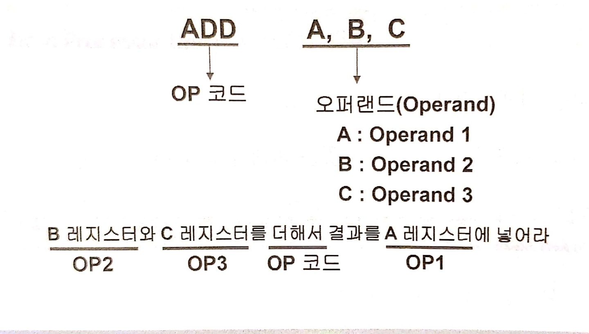

## 1.5 버스(BUS)
1. 폰 노이만(Von-Neuman) 아키텍처
    - 명령어와 데이터를 구분하지 않는다.
    - 같은 버스를 사용하기 떄문에 명령어를 읽을 때 데이터를 읽거나 쓸 수 없다.  
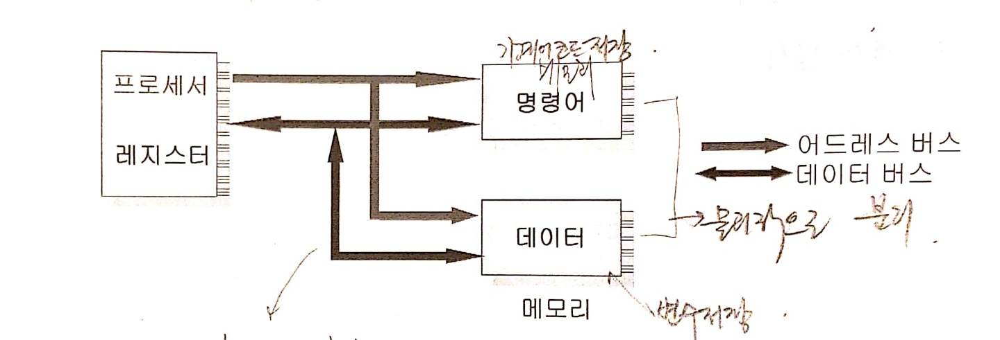
2. 하버드(Harvard) 아키텍처
    - 명령어와 데이터가 분리되어 있다.
    - 명령어를 읽을 때 데이터를 읽거나 쓸 수 있어 <u>성능이 좋아진다.</u>
    - 버스 시스템이 복잡해지고 설계가 어려워 진다.  
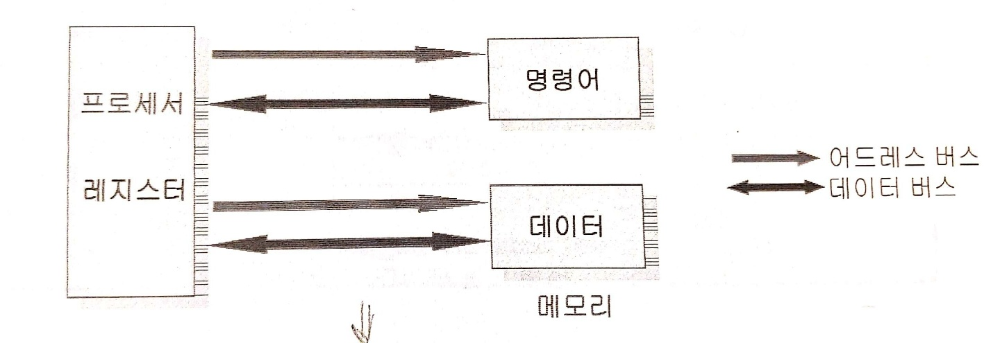

# 2. ARM Architecture

## 2.1 Programmer's Model
- 프로그래머가 프로그램(어셈블리어)을 작성하는데 필요한 각종 정보
- 명령어, 메모리 구조, 데이터 구조, 프로세서의 동작 모드, 프로세서 내부 레지스터의 구성 및 사용법, Exception 처리, 인터럽트 처리

## 2.2 ARM 프로세서의 명령어
- 16 비트 Thumb instruction set
- 32 비트 ARM instruction set
    - 모든 ARM 명령은 32비트 구성
    - Load/Stor와 같은 메모리 참조 명령이나 Branch 명령에서는 모두 상대주소(Indirect Address)방식을 사용
    - 32비트의 고정된 명령 길이를 사용하는 이유<u>(RISC 프로세서의 특징)</u>
        - Pipeline 구성이 용이
        - 명령 디코더의 구현이 쉽다.
        - 고속으로 처리 가능

## 2.3 메모리 구조
- Big/Little Endian
    - Big/Little Endian의 하드웨어 구조는 따로 정해져있다. 둘 다 지원하는 프로세서라 하더라도 하드웨어 설계단계에서 결정된 것은 이후에 바꿀 수 없다.
    - 컴파일러 또한 Big/Little Endian을 위한 것이 각각 따로 존재한다.  
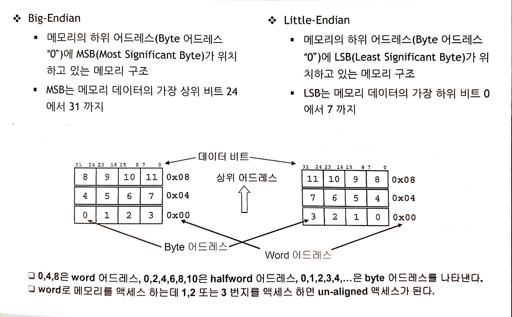

- ARM에서 사용 가능한 데이터 Type
    - byte : 8비트
    - Halfword : 16비트, 2 바이트
    - Word : 32 비트, 4 바이트
- Un-aligned access
    - 데이터 크기의 정수배 주소에만 access가능
    - Data abort 발생 (비정상적인 종료)  
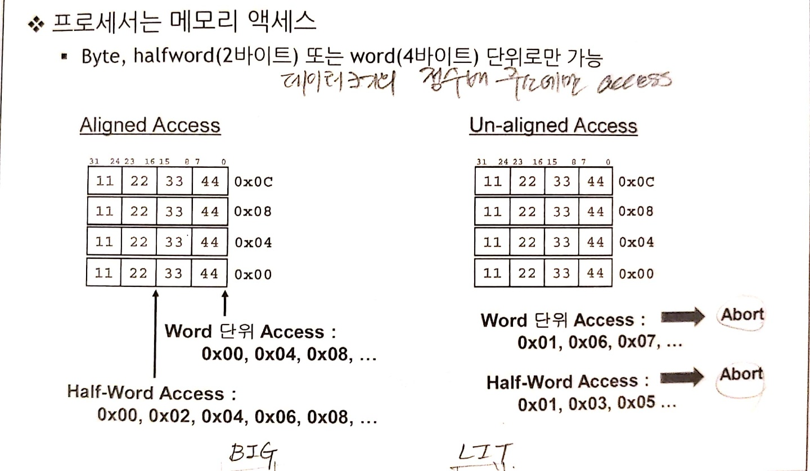

## 2.4 Operating Mode
Operating Mode는 현재 프로세서가 어떤 권한을 가지고 어떤 종류의 작업을 하고 있는지를 나타낸다.
- User Mode
    - User task 또는 어플리케이션을 수행할 때의 프로세서의 동작모드 (비유 : Linux의 user 권한)
    - ARM 프로세서의 동작 모드 중 유일하게 <u>Un-privileged 모드</u>
    - 메모리나 IO장치와 같은 시스템 자원을 사용하는데 제한이 있다.
- FIQ(Fast Interrupt Request) Mode
    - 빠른 인터럽트의 처리를 위한 프로세서의 동작 모드
- IRQ(Interrupt Request) Mode
    - 일반적으로 사용되는 인터럽트를 처리하기 위한 프로세서의 동작 모드
- SVC(Supervisor) Mode
    - 시스템 자원을 관리할 수 있는 프로세서의 동작 모드 (비유 : Linux의 root 권한)
    - Operating 시스템의 커널이나 드라이버를 처리하는 모드
    - <u>Reset이나 소프트웨어 인터럽트(SWI)가 발생하면 ARM은 Supervisor 모드가 된다.</u>

### 2.4.1 Exception
- 외부에서 발생되는 물리적인 조건에 의해서 정상적인 프로그램의 실행을 미루고 예외적인 현상을 처리하는 것 (Interrupt에서 확장된 개념)
- IRQ, FIQ를 비롯한 대부분이 Operating 모드는 <u>외부에서 발생되는 조건에 의해서 ARM 프로세서가 하드웨어적으로 변경한다.</u>

## 2.5 ARM 프로세서의 레지스터
### 2.5.1 ARM 레지스터 종류
- Genaral Purpose 레지스터
    - 대부분 데이터 연상 등에 사용
    - 프로세서 Operating mode에 따라 사용되는 레지스터가 제한된다.
- Program Counter(PC)
    - 프로그램을 읽어올 메모리의 위치를 나타낸다.
- CPSR(Current Program Status Register)
    - 프로세서가 수행하고 있는 현재의 동작 상태
- SPSR(Saved Program Status Register)
    - 이전 모드의 CPSR의 복사본

### 2.5.2 Operating 모드 별 레지스터
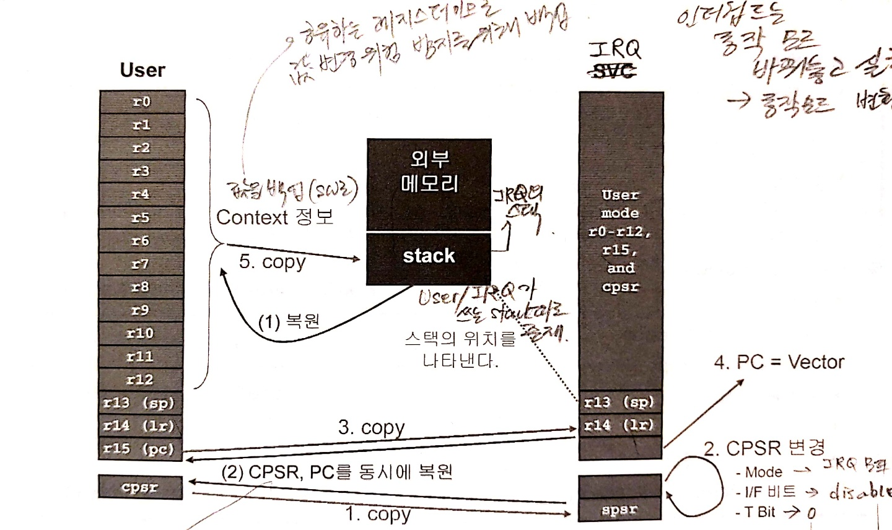

1. Stack Pointer
    - 프로그램에서 사용하는 스택의 위치를 저장하는 레지스터
    - 프로세서의 동작 모드마다 별도로 할당된 SP 레지스터를 가지고 있다.
    - 유한한 메모리를 효율적으로 사용하기 위해 stack 메모리 푤요
    - Full descending stack : 최상위 지점을 Stack pointer로 두고 하위 address로 내려오면서 데이터 크기만큼 (sp-4, sp-8, ...) 감소하는 형태로 <u>상대적인 주소</u>를 가진다.
2. Program Counter
    - 프로그램을 읽어내는 위치를 저장하고 있는 레지스터
3. Program Status Register
- PSR 레지스터의 정보
    1. Condition code flag : ALU의 연산 결과 정보를 가지는 flag 정보를 가지고 있다.
    2. Control bits : 프로세서를 제어하기 위한 비트로 구성
- 프로세서의 모드, 동작 state와 인터럽트 제어
    - I/F 비트 : IRQ(I 비트) 또는 FIQ(F 비트)를 disable(set) 또는 enable(clear)
    - T 비트
        - ARM Architecture xT 버전인 경우 Thumb state 임을 나타낸다.
        - 상태를 나타낼 뿐 강제로 값을 write 불가
    - Mode 비트 : ARM의 7가지 Operating mode를 나타낸다.
4. **Operating 모드의 변환과 레지스터**

<Excetption 발생시 동작 (operating 모드 변환의 일종)>  

#### 인터럽트 발생시에 Operating 모드 변환 과정
1. User의 CPSR 값을 SPSR에 복사 (user 모드의 mode bit가 저장)
2. IRQ 레지스터의 CPSR 변경
    - Mode 비트 : IRQ모드
    - I/F 비트 : disable(IRQ)/don't care(FIQ)
        - 인터럽트가 발생 후 핸들러가 진행되는 동안 다른 인터럽트가 발생하지 못하도록 IRQ가 disable 상태로 된다. 
    - T 비트 : 0
        - Interrupt 동작은 Thumb이 아닌 ARM state에서 실행 되므로 0 값 저장
3. User의 pc값이 IRQ의 lr에 백업된다. (일반적인 User 동작 위치가 저장)
4. PC에 Interrupt vecter가 저장되어 Interrupt 동작이 수행될 수 있도록 한다.
5. User의 범용 레지스터 값을 독립적으로 갖고있던 stack에 백업한다.

#### User 모드로 모드 복원과정
1. stack에 저장되어있던 범용 레지스터의 값이 복원된다.
2. **CPSR, PC를 동시에 복원한다.** 반드시!
    - CPSR이 PC보다 먼저 복원될 경우 : CPSR 복원으로 인해 User 모드로 바뀐 상태에서 PC가 여전히 Interrupt vector 값을 가지므로 다시 인터럽트 발생으로 이어질 수 있다.
    - PC가 PCSR보다 먼저 복원될 경우 : PC가 복원되어 이전에 진행하던 동작을 이어서 하려고 하지만 아직 IRQ의 권한을 가진 상태이므로 오작동 될 수 있다.
    - 따라서 CPSR, PC를 동시에 복원하게 하는 명령어 **__attribute__**가 핸들러 선언 앞에 사용된다.

## 3. ATPCS (ARM/Thumb Procedure Call Standard)
C언어와 어셈블리간에 호출관계에 대한 규칙

### 3.1 레이블(Label) 작성법
1. 알파뉴메릭(알파벳과 숫자, _ 포함)으로 작성
2. 1번 column에 작성  
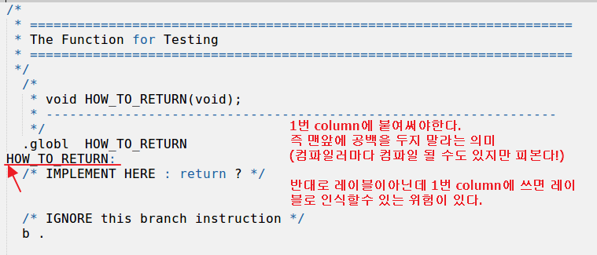
3. 콜론( : )은 있을 수도 없을 수도 있다. (컴파일러 마다 법칙이 다를 수도 있다.)

#### bl : branch with link
- 어셈블리어에서 함수분기 실행
- LR(복귀주소), PC(이동할 함수 주소)를 각각 저장시켜준다.  
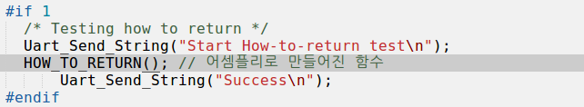

disassemble 코드 생성 명령  
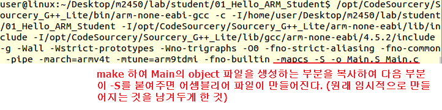
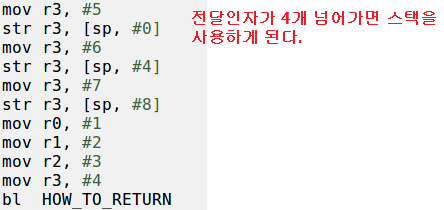

> HOW_TO_RETURN 함수 어셈블리어 모습  

- mov : 대입 연산자
- 함수의 반환값은 r0에 저장된 것을 가지게 된다.
- mov pc, lr 리턴 명령. 명령이 있어야 본래 함수로 복귀할 수 있다.
- .global : .은 지시자, 니모닉 코드. 없으면 함수를 찾을 수가 없다.
- b . : while(1)의 역할

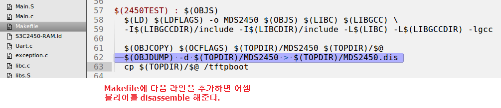
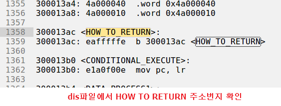
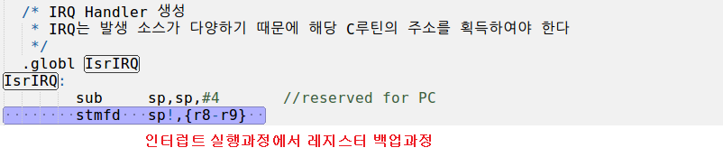
