# ARM 프로세서의 명령어2
- ARM의 Load/Store Architecture
    - memory to memory 데이터 처리 명령으 ㄹ지원하지 않음
    - 처리하고자 하는 **데이터는 무조건 레지스터로 이동**해야 한다.
    - 처리 절차
        1. 데이터를 메모리에서 레지스터로 이동
        2. 레지스터에 읽혀진 값을 가지고 처리
        3. 연산 결과를 메모리에 저장
- ARM의 메모리 액세스 명령
    - Single register data transfer(LDR/STR)
    - Block datat transfer (LDM/STM)
    - Single Data Swap (SWP)

## 1. Single register data transfer (LDR/STR)
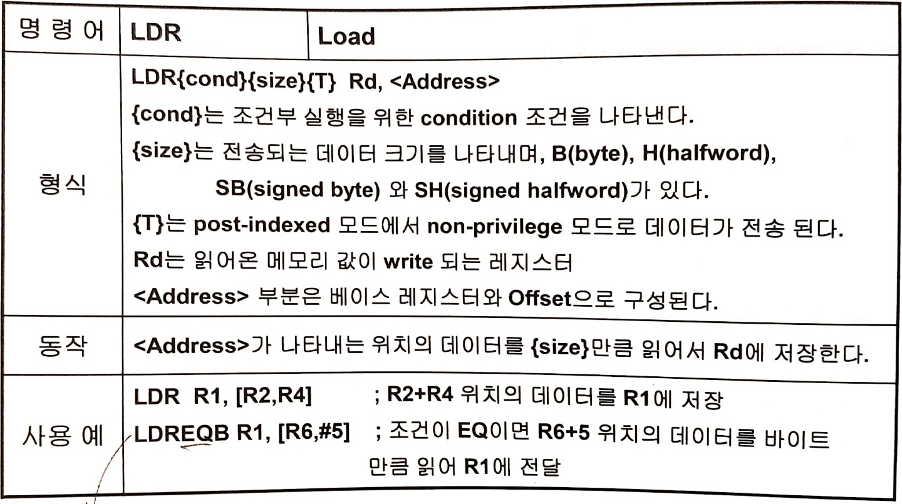

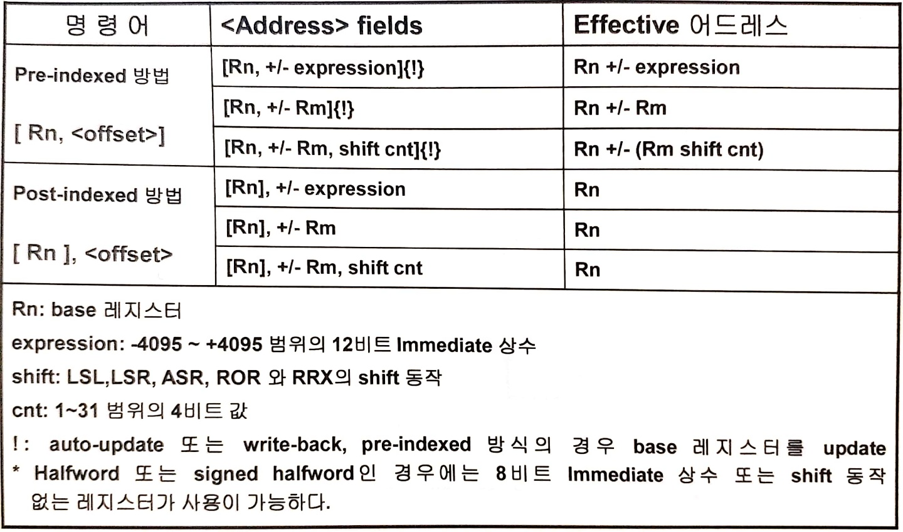

### 1.1 Pre-indexed Address Mode
```
ldr r0, [r1, #4]! @r1=0x30100000 -> 0x30100004
str r0, [r2, #0x64]! @r1=0x30100000 -> 0x30100064
```
- [Rn, `<offset>`] : 명령어 실행 과정에서 Rn+offset 위치의 데이터를 나타내게 된다.

### 1.2 Post-indexed Address Mode
```
ldr r0, [r1], #64 @r1=0x30100000  0x30100004
str r0, [r2], #4 @r1=0x30100000  0x30100064
```
- [Rn], `<offset>`: 명령어 실행 과정에서는 [Rn] 위치의 데이터를 참조하게 되고 명령어 연산 후 Rn은 Rn+offset의 주소를 참조하게 된다.

### 1.3 Relative 어드레스 지정 방식
- Label 지정에 의한 어드레스 지정
    - 어셈블리어에서 LABEL을 지정하면 어셈블러가 [PC+LABEL] 형태의 주소로 변환하여 참조
    ```
    LDR r0, label_1
    ......
    label_1 DCD 0x12345678
    ```
    - DCD를 이용해 0x12345678을 상수로 지정해두고 label_1으로 할당해 주었다.
        - DCD : Define Constant Data
    ```
    LDR r0, [PC, #offset]
    ......
    DCD 0x12345678
    ```
    - 컴파일러가 상수가 저장된 위치로 offset을 알아서 지정하여 참조하게 된다.

- literal pool을 사용한 32 비트 데이터의 Load
    - 어셈블러가 코드 영역 내에 데이터 저장 후 [PC+LABEL]형태의 주소로 변환하여 참조
    ```
    LDR r0, =0x5555AAAA
    ```
    ```
    @ 어셈블러 자체적 데이터 저장
    LDR r0, [PC, #offset]
    ......
    DCD 0x5555AAAA
    ```
- 주의할 점
    ```
    ldr r0, =0x30100000
    @ 0x30100000값을 r0에 저장

    ldr r0, 0x30100000
    @ 0x30100000번지에서 값을 읽어오는 의미
    ```
    예시)
    ```
    @ label1의 주소를 r0에 읽어 오는 것
    ldr r0, =label1
    .......
    label1 DCD 0x12345678
    ```  
    ```
    @ label1에 저장된 0x12345678을 r0에 읽어오는 것
    ldr r0, label1
    .......
    label1 DCD 0x12345678
    ```


## 2. Block Data Transfer
- 하나의 멸령으로 메모리와 프로세서 레지스터 사이에 여러 개의 데이터를 옮기는 멸령
- Block Data Transfer의 응용
    - **Stack operation**
        - LDM/STM 이용하여 pop 또는 push 동작 구현

```
ldm r0, {r4, r5, r6} 
@ 아래와 같이 표현하는 거보다 ldm을 사용하는 것이 코드길이, 속도 면에서 낫다.
ldr r4, [r0]!
ldr r5, [r0]!
ldr r6, [r0]!
```
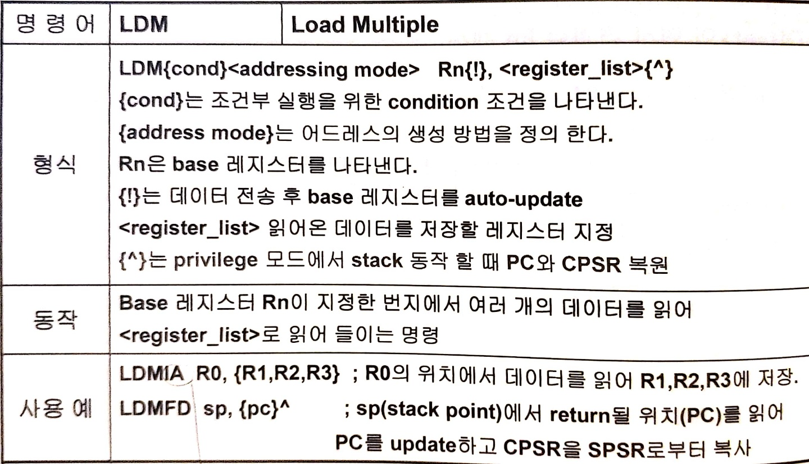
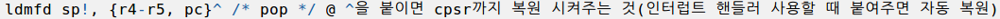

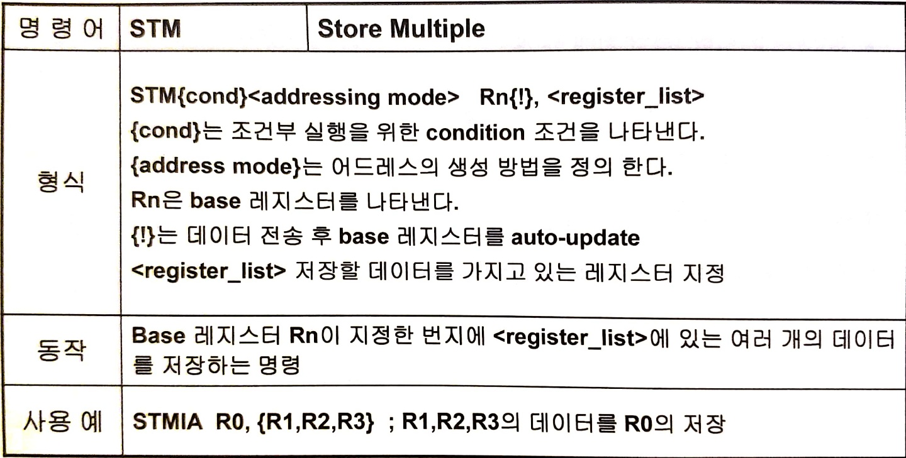

### 2.1 LDM/STM의 어드레스 지정 방식

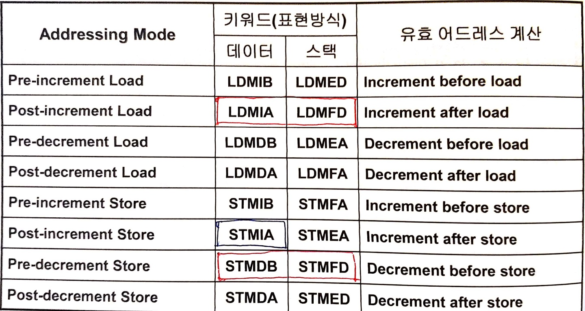


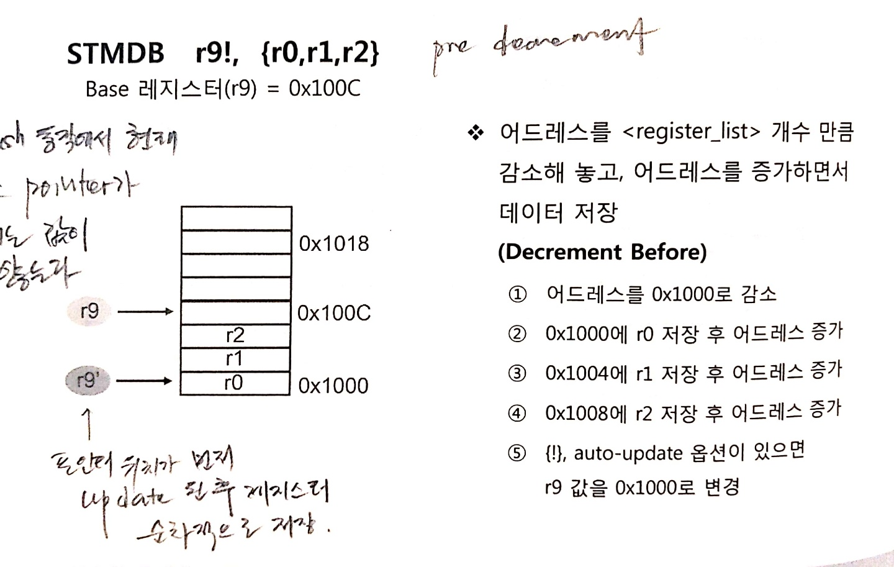
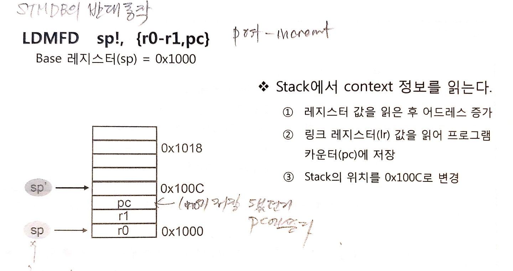

### 2.2 Stack과 Subroutine
- 스택의 용도 중 하나는 서브루틴을 위한 일시적인 레지스터 저장소를 제공하는 것
- 서브루틴에서 사용되는 데이터를 스택에 push하고 caller 함수로 return 하기 전에 pop을 통해 원래의 정보로 환원시키는 데 사용
- privilege 모드에서 LDM을 사용하여 Pop을 할 때 'S' bit set 옵션인 `^`가 레지스터 리스트에 있으면 SPSR이 CPSR로 복사 된다.
```
STMFD sp!, {r4-r12, lr} @ stack all registers
.......                 @ and the return address
.......
LDMFD sp!, {r4-r12, pc} @ load all the registers
                        @ and return automatically
```
## 3. Single Data Swap (SWP)

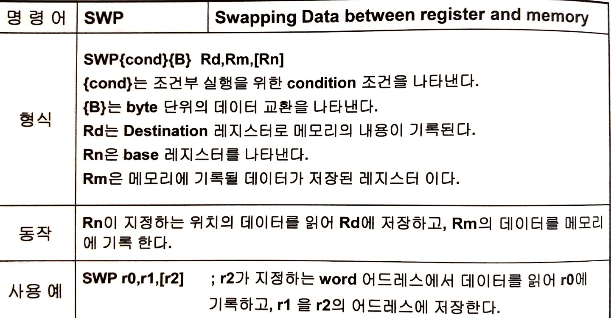

### 3.1 Swap 명령의 동작

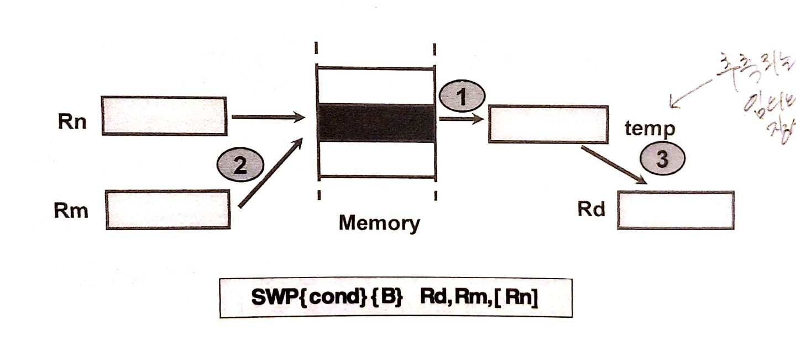

1. Rn이 지정하는 메모리의 내용을 임시 버퍼에 저장
2. Rm에 있는 값을 메모리에 write
3. 임시 버퍼의 내용을 Rd로 load


## 4. 어셈블리어의 loop 문 구현

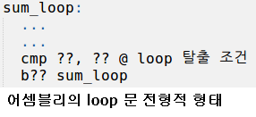

### 4.1 1~100 합 구하기
- main 문

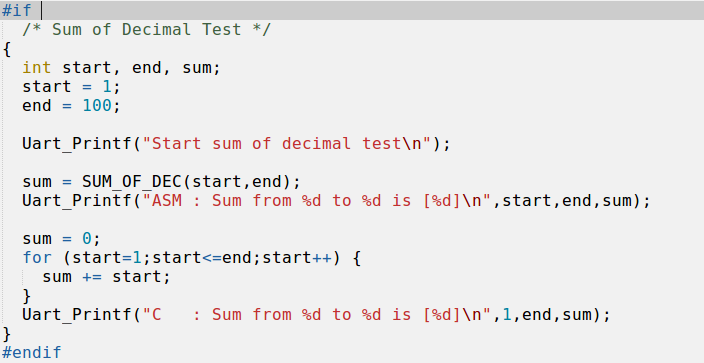

- 어셈블리어 함수 구현

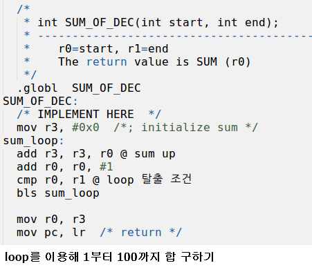

- 결과

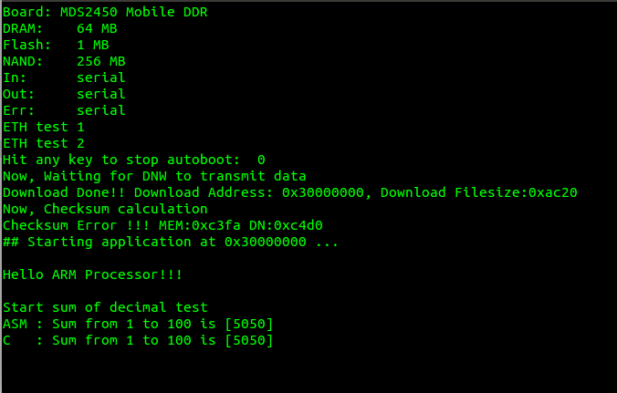

### 4.2 메모리 copy 하기

- 구현

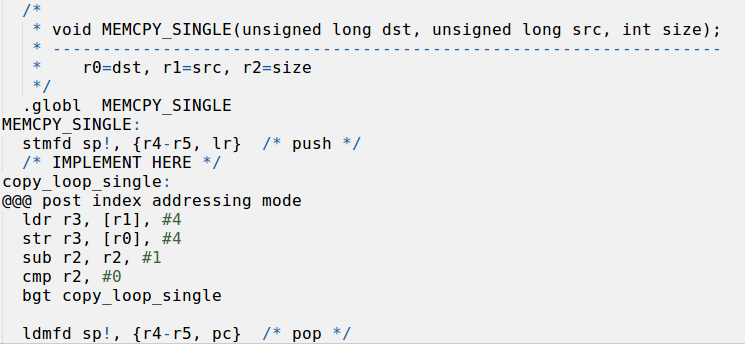

- ldrb, strb를 이용하여 8bit(1byte)씩 복사하기

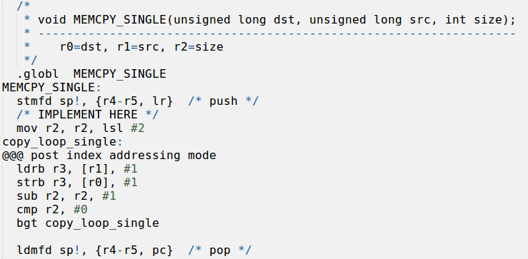

- 결과

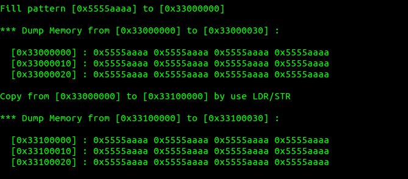

### 4.3 메모리 copy 하기 - 3개씩 한번에 복사

- ldmia, stmia를 이용하여 데이터 size 3개씩 복사 구현

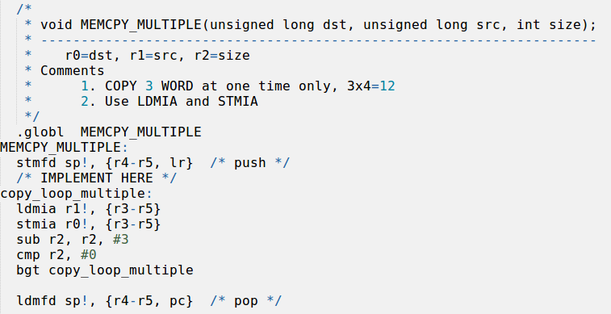

- 결과

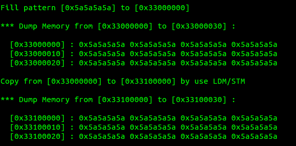

- 접미사 S 사용
    - S 접미사를 넣으면 연산 결과를 가지고 Condition Flag를 set 시킨다.

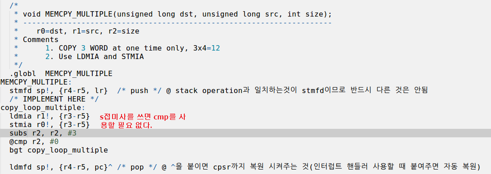


# Thumb state 명령어

- Thumb state 명령어를 확인하기 위해 Makefile 설정 변경

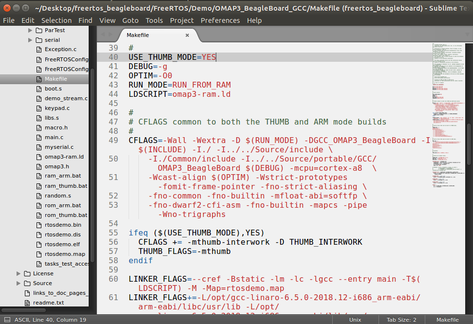

- Thumb/ARM state로 컴파일해야 하는 source 리스트

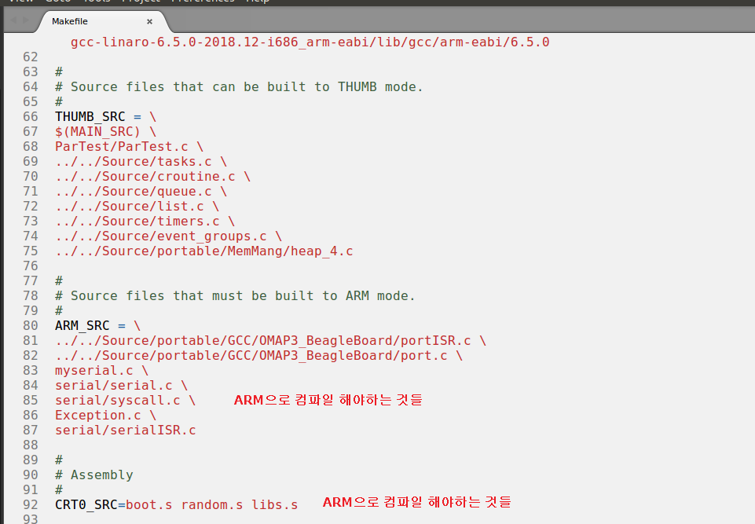

- Thumb state 명령어 확인

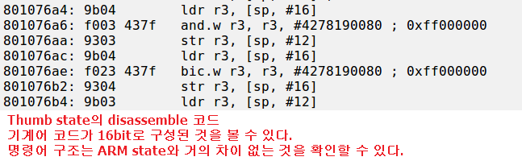

## 1. Count Leading Zero 명령
- MSB로 부터 최초 1이 나타내는 위치 검색
- **CLZ 명령 응용** : 인터럽트 Pending 비트 검사

- ARM 모드에서 실행되지 않는 CLZ 명령

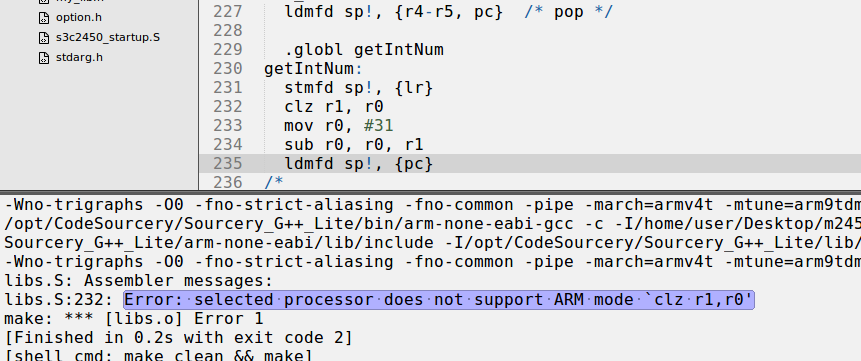

- Makefile에 설정되어있는 컴파일 기준 모델

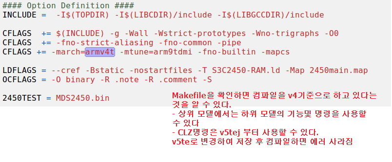

- CLZ 이용해 레지스터의 pending 비트 검사


# Cache와 ARM 프로세서
- Cache란 메모리로부터 프로그램이나 데이터를 계속해서 불러오기가 비효율적이므로 CPU와 붙어있는 공간에서 쉽게 꺼내 쓸 수 있도록 만들어진 메모리
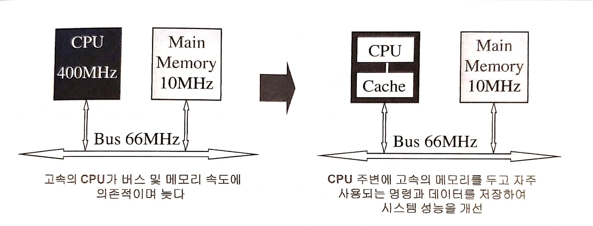

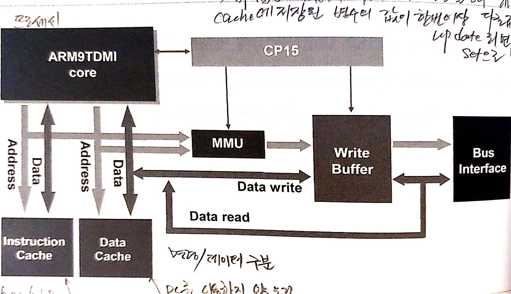
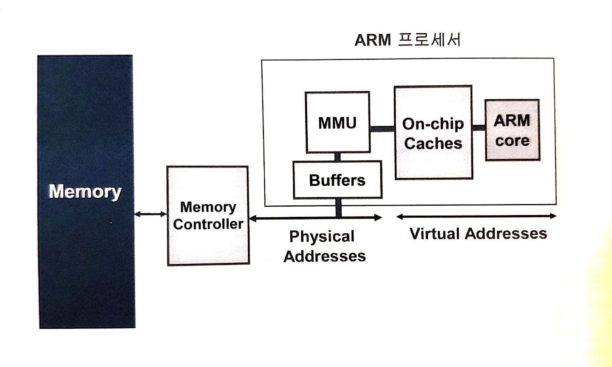


- 명령과 데이터는 CPU가 어떻게 구분해서 Instruction/Data Cache로 분리하여 할당하는 것인가?
    - PC(Program Counter)를 이용해 참조 된 것은 Instruction, 그렇지 않은 것은 Data로 구분 된다.

- Cache의 `Hit`와 `Miss`
    - Cache `Hit` : 읽으려는 명령어 혹은 데이터가 Cache에 존재하는 것을 의미, 그대로 손쉽게 갖다 쓰면된다.
        - 프로그램 실행과정에서 Hit가 많이 일어난다는 것은 그만큼 빠른 속도, 높은 효율로 구동된다는 의미
    - Cache `Miss` : `Hit`와 반대로 읽으려는 명령어 혹은 데이터가 Cache에 존재하지 않는 경우.

- 캐시의 기본 원리
    1. 공간 참조
        - 예를 들어 같은 라인에 다수의 변수를 선언한 경우 이 중 하나의 변수를 읽어 들일 때 인접한 변수들을 다같이 Cache로 불러들인다.
        - 이 후에 다른 인접한 변수를 읽어야 할때는 `Miss`가 아닌 `Hit`가 발생하게 된다.
        - 결국 인접한 변수 끼리는 서로 반복되어 쓸 **확률**이 높다고 판단한 것으로 부터 설계 됨
    2. 시간 참조
        - 한번 읽었던 명령어가 머지 않은 시간안에 또 읽게 되는 것을 의미(루프 형태 코드, 함수)
        - 함수를 만들었다는 의미 자체가 계속 반복해서 읽을 거라는 의미

- Cache라는 것은 채우는 단위기도 하지만 버리는 단위기도 하다.
    - Cache에 채워지는 것은 소프트웨어적 **확률**에 기반하여 자주 쓸 가능성이 있는 것들로 채워진다.
    - 우선적으로 채워지게 되면 Cache 용량은 한정적이므로 오래된 것들을 버려야하는 동작이 동반 될 수 밖에 없다.
    - 버려지는 명령, 데이터를 `Victim`이라고 한다.

- Cache 라인의 tag : `Valid/Dirty bit`
    - Cache 라인마다 존재
    - `Valid bit`
        - `Miss`가 발생하여 Cache 라인으로 가져오게 되면 `Valid bit`가 set이 된다.
    - `Dirty bit`
        - Data cache에만 존재 (Instruction Cache는 CPU가 읽기만 하지만 Data Cache에는 CPU가 읽기도하고 쓰기도 한다.)
        - 예를 들어 loop에 들어있는 변수가 처음 0으로 초기화되어 Cache에 저장되고, loop를 돌면서 프로그램 상에서 변수의 값이 변경된다면 Cache에 저장된 초기화된 변수와의 inconsistency(불일치)가 발생한다. 이때, `Dirty bit`가 set 된다.
        - 결론은 처음 Cache에 저장된 Data가 값의 변화가 생길 때 `Dirty`상태가 되는 것(Cache data와 메모리 data 불일치)

- Cache 관리 방법 : Write(copy) Trough/Back
    1. writhe Trough
        - CPU가 특정 주소에 명령이나 데이터를 write하는 경우, 해당하는 명령이나 데이터가 Cache 메모리에 있을 때, Cache 메모리와 외부 메모리에 모두 쓰기 동작을 한다. 
        - Write buffer를 거치지 않고 메모리에 저장
        - 아무래도 성능은 떨어지게 된다.
    2. Write Back
        - CPU가 특정 주소에 명령이나 데이터를 write하는 경우, 해당하는 멸령이나 데이터가 Cache 메모리에 있을 때, Cache 메모리에만 쓰기 동작을 하고, 외부의 메모리에는 나중에 기록 된다.
        - Write buffer를 사용한다. 
        - 나중에 `dirty bit`를 확인하여 메모리에도 값을 update해준다.
        - 성능적으로는 빠르지만 메모리에 당장 update 되진 않는다.
        - 혹시 강제로 update 시켜주고 싶을 때는 Coprocess Register를 이용해서 할 수 있다. (MCR 명령)

- Cache Clean
    - `dirty bit` 체크 된 것들을 모두 메모리에도 update 시켜주는 것
- Cache flush
    - `Valid bit`가 체크 된 것 데이터나 명령들을 모두 reset 시켜버리는 것 (동의어 : cache invalidate)

# Cached ARM 프로세서의 제어

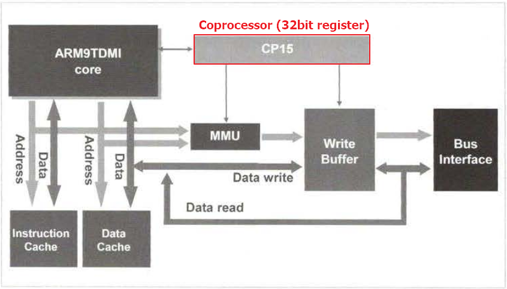

## 1. Cache 제어 (disable/enable)
- CP15 인터페이스를 통해서 제어
- Coprecessor Register Transfer 명령
    - MRC : Move to Register from Coprocessor
        - Coprocessor 레지스터 내용을 ARM 레지스터로 전송
    - MCR : Move to Coprocessor from Register
        - ARM 레지스터의 내용을 Coprocessor 레지스터로 전송

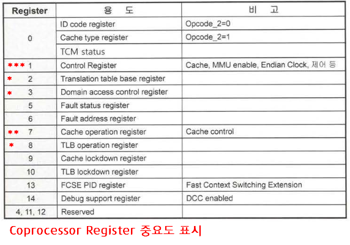

> MCR/MRC{cond} p15, opcode_1, rd, cn, cm, opcode_2  
>   - P15 : Coprocessor 15를 의미  
>   - opcode_1 : 항상 0
>   - rd : ARM의 source 또는 destination 레지스터  
>    - cn : primary CP15 register  
>    - cm : additional register name
>    - opcode_2 : additional information 표시

### 1.1 ICache enable/disable 코드
<libs.S 어셈블리어로 구현된 ICache enable/disable 코드>
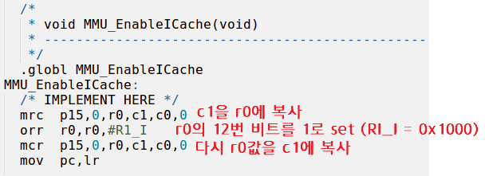
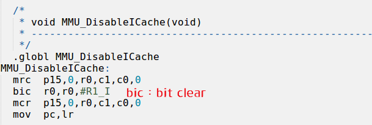

<Control(Coprocessor) Register c1>
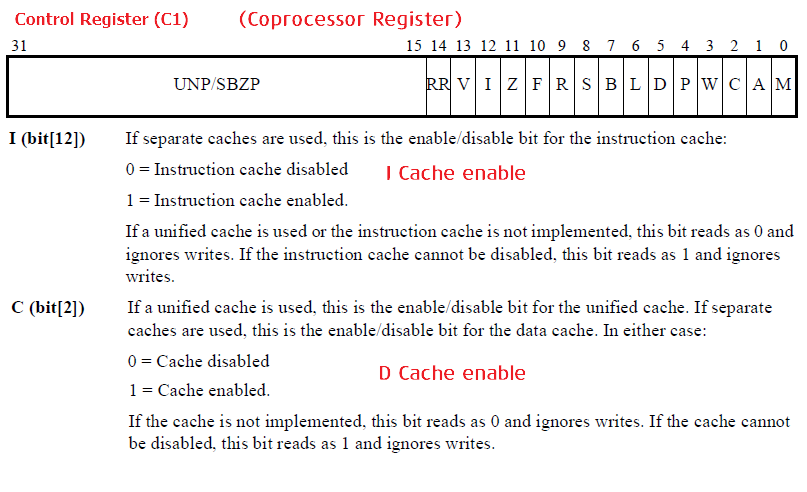
- ARM Architecture Reference 문서 참조
- Coprocessor register 중 c1이 가장 중요

<이 외의 Control Register 주요 기능>
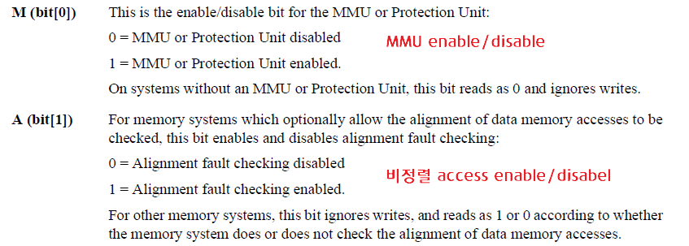
<c0 레지스터>
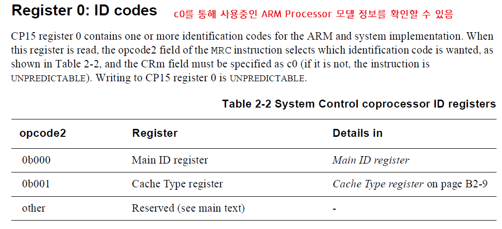

### 1.2 Cache flush(invalidate) 코드
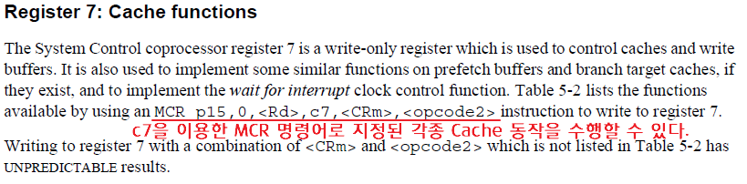
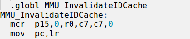
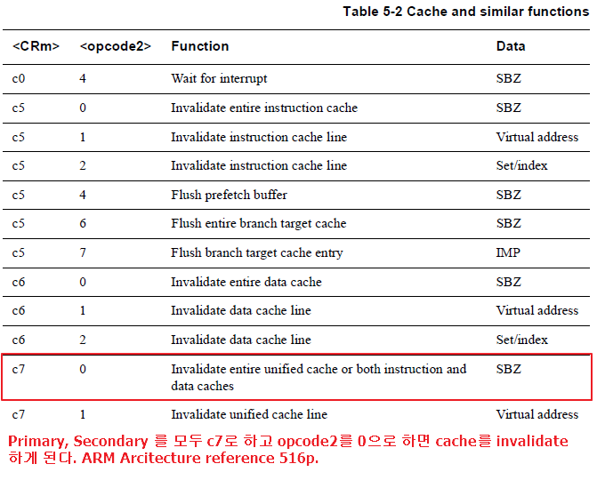

## 2 Write Buffer

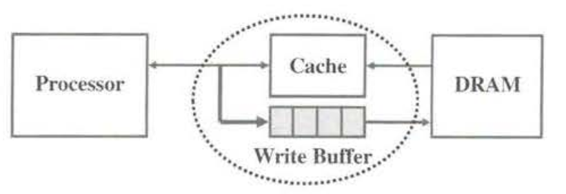
- 캐시처럼 속도가 빠른 장치
- **Core와 버스의 서로 다른 속도 차 극복**
    - Core speed로 write buffer에 데이터를 write
        - <u>Write 후 CPUD는 다른 작업 처리 가능</u>
    - Bus speed로 write buffer의 내용이 메모리로 write
    - Write buffer는 FIFO 형태의 구조를 가진다.

## 3. Cache와 Write Buffer 제어
- Section 또는 page 별로 Cache와 Write Buffer의 사용여부 결정
- 주의할 점 : <u>**Memory mapped I/O장치(주변장치)들은 반드시 Cache, Write buffer 사용이 diable 되어있어야한다.**</u>
    - Cache는 데이터를 복사해서 저장해두는 컨셉이다. 따라서 외부 신호에 따라 데이터가 지속적으로 변할 수 있는 것에 대해서는 Cache에 저장해두면 실제로 주고 받는 값과 mismatch가 일어나게 될 것이기 때문이다.
    - 예) UART의 RX 버퍼 레지스터의 경우 외부에서 전달되는 데이터 값이 버퍼에 지속적으로 update되는데 이것이 Cache에 저장되면 Cache는 처음에 복사된 값만을 갖고 update되지 않아 제대로된 동작을 수행하지 못한다. 따라서 주변장치와 Cache의 컨셉이 서로 맞지 않게 된다. (DMA 등도 마찬가지!)

## 4. (정리) Cache 부분에서 꼭 기억해야할 것!
1. I-Cache / D-Cache 활성화 방법
2. Memory Mapped I/O D-Cache 비활성화
    - 주변장치의 컨셉이 Cache와 맞지 않는다.
    - DMA를 쓸 떄는 D-Cace를 off시킨 상태에서 진행해야한다.
3. Cache(D-Cache) Clean과 Cache Flush(Invalidate)


# MMU (Memory Management Units)
- MMU는 OS가 탑재된 임베디드에서만 꼭 필요하다. OS가 없는 펌웨어 개발시 필요하지 않다.
- 메모리 보호 기능
    - 가상주소 활성화, MMU enable 상태에서만 메모리 보호 기능 사용가능
    - 메모리의 특정 구역을 설정하여 권한이 없으면 접근하지 못하게 한다.
- 어드레스 변환 기능
    - CPU에서 사용되는 logical한 Virtual 어드레스를 Physical 어드레스로 변환
    - 어떤 가상 주소지로 변환될지는 프로그래머가 직접 설정한다.

## 1. MMU의 필요성
- Dynamic 한 메모리 관리
    - 프로그램 실행 중에 수시로 access permission 관리, cacheable/bufferable 특성의 변환 가능
    - 보다 세분화된 공간 활용의 메모리 관리 가능
    - 시스템 동작 중에도 메모리 변환이 가능하다.
- 메모리의 안전성 향상
    - 접근 권한 관리로 일반사용자들이 데이터 포멧 등으로 자원을 훼손 할 수 있는 경우를 방지해준다.
 ## 2. MMU의 구성
- Translation Lookaside Buffer (TLB)
    - 최근에 사용된 Virtual address를 Physical address로 변화하는 정보와 access permission에 대한 정보를 저장하고 있는 일종의 Cache
    - TLB가 Virtual 어드레스에 대한 translation table entry를 가지고 있으면 access control logic이 access 가능을 판단
        - 접근이 허용되면 virtual address를 physical address로 변환 후 access
        - 접근의 허용이 안되면 CPU에 Abort 구동
    - TLB에 virtual 어드레스에 대한 정보가 없으면 translation table walking logc에서 table 정보를 physical 메모리에서 읽어 TLB update
- Translation Table Walking Logic
    - TLB를 update하고 관리하는 기능을 가진 logic
- Access Control Logic

## 3. (정리) MMU 부분에서 꼭 기억할 것!
1. 링커(Linker) 스크립트 파일에서의 주소 표현
- 가상주소를 필요로하는 소프트웨어는 링커 스크립트 파일의 가상주소를 써서 실행한다.
- 시작 주소가 30000000이 아니라 임의로 C0000000라는 주소로 입력해도 프로그램이 정상 실행 될까?
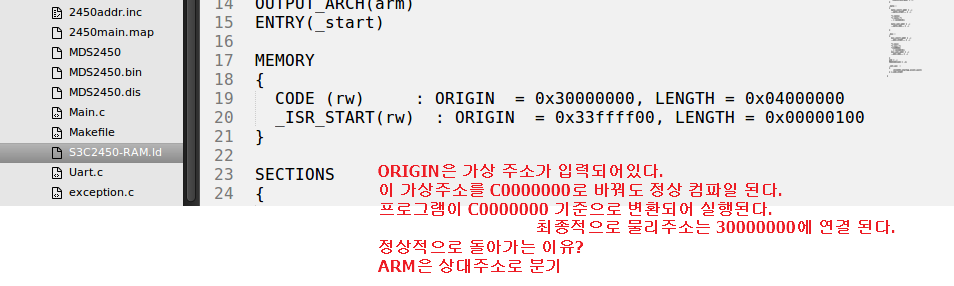
- Linker script 파일에 ORIGIN에 대입된 주소 값을 30000000이 아닌 C0000000으로 변환시켜 본다.
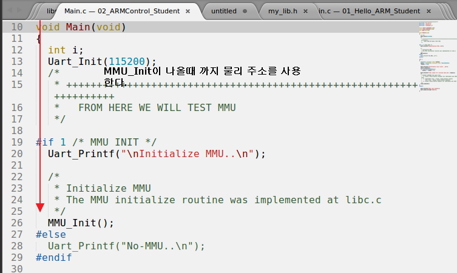
- 상식적으로 생각하면 Main에서 MMU_Init이 발생하기 전에는 물리주소로 실행되므로 가상주소 배치가 이루어지지 않은 상황에서 주소 체계가 꼬여 프로그램 실행이 잘 안될 것이라고 예상할 수 있다.
- 정답 : 정상적으로 프로그램이 실행된다.
- 이유는 ARM 프로세서는 분기를 할 때 상대주소로 분기를 하게 되므로 임의로 시작 주소를 변경해도 정상적으로 프로그램이 동작 되는 것이다.
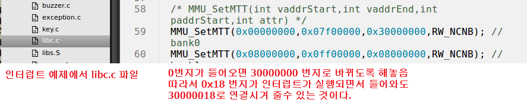

2. 예외처리(Exception) 벡터 테이블
3. 보호된 메모리 접근 -> Data Abort
4. 존재하지 않는 가상 메모리 접근 -> Data Abort

### 기타 실습
- MMU_Init 함수 내에 Cache Enable 동작 확인

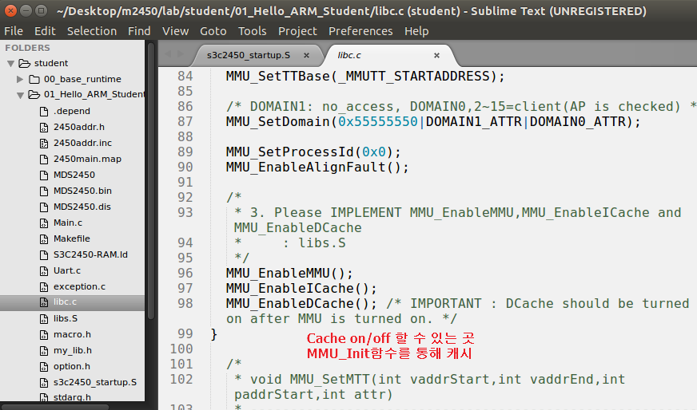

- Cache가 모두 Enable 상태에서 시간 측정

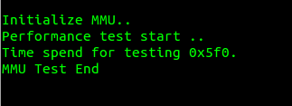

- ICache를 disable 후 시간 측정

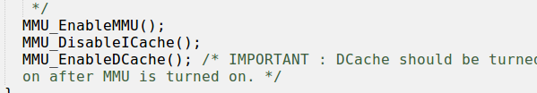
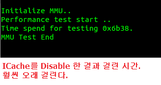


- Control Register 설정

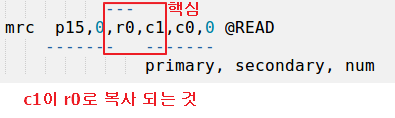
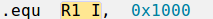


- Cache flush(invalidate) 동작 함수


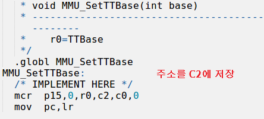
