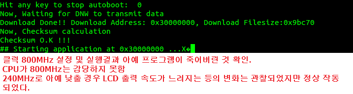

# AMBA Bus

- AMBA(Advanced Microcontroller Bust Architecture)
    - ARM에서 개발하여 오픈 한 표준 시스템 버스 설계 규격
    - SoC를 구성하는 기능 블록들 간의 연결 및 관리 방법 제공
- 표준 AMBA 버스의 장점
    - SoC 설계자 간의 의사 소통 용이
        - <u>설계자 간의 idea 공유로 SoC 설계 시간 단축(ARM의 주요 성공 요인 중 하나)</u>
- AMBA 버스 Type
    - AHB(Advanced High-performance Bus)
        - High performance
    - ASB(Advanced System Bus)
        - High performance
    - APB(Advanced Peripheral Bus)
        - Peripheral Bus
    - AXI(Advanced eXtensible Interface)
        - ARM11 부터 적용
        - AMBA 버스 Spec. 3.0
        - High performance
        - High frequency and Low power

# Clock 설정
- 보통, 시스템의 동작은 외부의 낮은 Clock을 PLL을 통하여 높은 Clock으로 증가시키고 이를 동작 Clock으로 하여 내부 회로를 구동시킨다.
    - 외부의 낮은 Clock -> PLL -> 높은 동작 Clock
- Mpll -> Main Clock
    - ARMCLK, HCLK, PCLK, DDRCLK로 분주된다.
- Epll -> USB Clock, CAM Clock, LCD Clock, I2S Clock, UART clock으로 출력

## 1. Clock 설정 방법

- Clock 변경 실습 (FCLK 600MHz)  

- Clock 변경 실습2 (FCLK 800MHz)  

- FCLK외 PCLK, HCLK 등에 대해 각각 설정 변경  

# Power 관리
- CLK 주파수가 클수록 전력소모가 크다!
- Power Management Block : Power 소모를 줄이기 위하여 소프트웨어적으로 시스템 clock을 제어
- Pwer Management Mode
    - NORMAL 모드 : CPU 및 모든 제어 block이 정상 동작
    - IDLE 모드 : 주변장치는 동작하지만 CPU core는 정지. 인터럽트에 의해 IDLE모드 벗어난다.
    - STOP 모드 : PLL없이 저주파 동작 Clock으로 사용 전력소모 줄임
    - SLEEP 모드 : 가장 많이 사용하는 모드. 주변장치를 포함하는 코어전력을 셧다운. EINT, RTC alarm 인터럽트 등에 의해 POWER_OFF 모드에서 깨어남
    

# 메모리 시스템

# ARM Cross Compile

## 1. Linux 사용 컴파일러

## 2. ATPCS (ARM Thumb Procedure Call Standard)

- PCS(Procedure Call Standard) : C/C++에서 함수를 호출하거나 호출 받을 때는 매개변수나 반환값을 주고 받게 되어있다. 이렇게 규정된 규칙을 의미
- ATPCS는 ARM모드와 Thumb 모드 둘 다 호환되는 함수 호출 규약을 의미
- 컴파일러와 어셈블러에서 레지스터가 아래의 정해진 용도로 사용된다.

## 3. 소프트웨어 동작을 위한 메모리 구조

- text : 모든 code block, 기계어 코드
- data : 초기화된 전역변수 및 초기값
- bss : 초기화 되지 않은 전역변수
- heap : 메모리 동적할당 변수

## 4. Object 파일의 자료 구조
- Object 파일
    - 컴파일러나 어셈블러에 의해서 만들어진 바이너리 format의 파일
    - 명령어와 자료구조 정보로 구성 되어 있다.
        - Header, section, symbol table 등으로 구성되어 있다.
- Object 파일 format
    - COFF(Common Object File Format)
    - **ELF(Extended Linker Format)**
        - .o파일들이 결합하여 ELF를 만들어 낸다.
        - 하위 파일들에서 사용된 명령어 및 함수들이 분류되어 각 section으로 연결되게 된다.

## 5. 링커(Linker)

- Linker
    - 불완전한 object 파일들을 합쳐 모든 코드와 데이터를 포함하는 새로운 object 파일을 생성해 내는 도구
    - 필요에 따라 라이브러리와 초기화(start up) 파일을 같이 링크 한다.
- Startup 코드
    - 어셈블러로 구성되며 모든 프로그램에 반드시 필요
    - startup 코드 동작
        1. 시스템 초기화
        2. Data 초기화
        3. Stack 영역 할당
        4. Heap 영역 할당
        5. 메인 함수(main)를 호출
- Locate
    - 메모리에서 실행 가능하도록 코드와 데이터를 배치하여 최종 바이너리 이미지를 생성하는 도구
    - **대부분 링커에 포함되어있다.**
- Linker script 파일
    - 코드와 데이터의 메모리 배치를 정의한 파일

### 5.1 Linker 파일 분석
- 개발할때는 제공받은 Linker script 파일을 두고 필요한 부분만 수정해서 쓴다. -> *깊이 알지말고 의미만 파악해라!*

<Linker script 파일(.ld)>  

<인터럽트 주소 할당을 위한 임의의 섹션(.ld)>  

<.map 파일의 주소 값>  

- .map 파일은 링커가 만든 리포트 파일(로그 파일)

<어셈블리어의 Local label>  

### 5.2 stack 직접 관리

<startup 코드, 메모리 컨트롤러 세팅>  

<startup 코드 stack 할당 초기화>  

<startup 코드 모드별 stack 크기 할당>  

# Exception
- Exception 이란
    - 외부의 요청(`인터럽트`)이나 오류(`abort`)에 의해서 정상적으로 진행되는 프로그램의 동작을 잠시 멈추고 프로세서의 동작 모드를 변환하고 미리 정해진 프로그램(`핸들러`)을 이용하여 외부의 요청이나 오류에 대한 처리(`소프트웨어 실행`)를 하도록 하는 것
## 1. ARM의 Exception 종류
- Reset
    - POR (Power On Reset)
    - H/W 레셋 (리셋 스위치 입력)
    - WDT 리셋
        - 비정상적 error로 인한 리셋
    - S/W 리셋
        - 레지스터 설정을 통한 리셋
    - PC = 30000000 (bootcode return)
        - 정식 리셋은 아니지만 PC에 시작주소를 넣는 것
- Undefined Instruction
    - 코드 해독(decode)이 제대로 되지 않음
    - coprocessor에 전달하여 여기서도 처리 못해 reject가 나오면 발생
    - 부정적 예외 처리
- Software Interrupt  
    
    - 외부 전기신호로 인해 Interrupt가 걸리는 것이 아닌 SWI 명령어로 발생
    - SWI 명령어에 원하는 서비스 코드를 넣으면 시스템 호출이 되어 리눅스 커널이 원하는 요청을 실행시켜 준다.
    - S/W Interrupt를 실행하면 User모드에서 Supervisor(SVC)모드로 변환된다.
        - 요술 램프(SWI 명령어)을 문지르면 지니(리눅스 커널)가 나와(Supervisor 모드) 소원(요청)을 들어주고 다시 램프로 들어간다.(User모드 복귀)
    - Firmware에서는 쓰지않고 OS에서만 쓰는 것
- Prefetch Abort & Data Abort
    1. 비정렬 엑세스(Data Abort only!)
        - 비정렬 Access를 하면 Data Abort 발생
        - PC는 알아서 주소지 increment를 하기 때문에 비정렬 access가 prefetch abort 원인이 되지 못한다.
    2. 보호된 메모리 엑세스
        - 특권 모드에서 접근해야하도록 설정해놓은 메모리 영역을 User모드로 접근했을 경우
    3. 존재하지 않는 가상 메모리 액세스
        - 가상주소 영역 record는 있지만 Base table을 만들어 놓지 않은 영역에 접근할 경우
- IRQ
- FIQ
    - IRQ / FIQ 포트로 Interrupt 신호가 들어오면 발생

## 2. Exception Vector와 우선순위
- Exception vector
    - Exception이 발생하면 미리 정해진 어드레스의 프로그램을 수행
    - 미리 정해진 프로그램의 위치를 Exception vector라 한다.

- Exception Vector Table
    - 각 Exception에 대해 Vector를 정의 해놓은 테이블
        - 각 Exception 별로 1 word 크기의 명령어 저장 공간을 가진다.
    - 실제 Exception을 처리하기 위한 루틴으로 분기 할 수 있는 명령으로 구성되어 있다. (Branch와 유사)
        - <u>FIQ의 경우는 Vector Tabel의 맨 상위에 위치하여 분기명령 없이 처리루틴을 프로그램 할 수 있다.</u>
    - ARM은 기본적으로 0x00000000에 Vector Tabel을 둔다.
        - MMU 제어 프로그램에 의해 위치 변경 가능
- Exception 우선순위
    - 동시에 Exception이 발생하는 경우 처리를 위해 우선 순위 지정 (사전에 fixed 되어 있음)
    - `777`이란?
        - 37개의 레지스터, 7개의 동작모드, 7개의 Exception(예외 처리)
- User 모드에서 protected 된 메모리 영역에 접근하는 방법 (*Linux OS에서 필요로 하는 기법*)
    - SWI, IRQ의 공통점 : 둘다 특권모드로 전환된다.
        - MMU를 통해 protected된 메모리 영역을 User모드에서 접근하려고 할때 *SWI나 IRQ를 이용해서 특권 모드로 임시적으로 전환 후* 접근할 수 있게된다.

## 3. Exception Handler

### 3.1 Data Abort 실습 (비정렬 Access 실행)
- 비정렬 Access 코드 작성  

- Abort 발생 결과  

- Abort 발생 process

### 3.2 Exception Handler 정의 방법!!
- Startup code에서 각 exception mode의 handler가 정의된다.  

- exception handler 들은 macro 함수를 통해 정의  

- exception handler를 굳이 macro로 어렵게 구현해놓은 이유?(vector table에 바로 핸들러 주소를 연결해두지 않은 이유?)
    - 만약 ROM에 프로그램을 이식했을 때 핸들러 주소를 바로 연결해두는 식의 하드코딩을 하면 case 별로 동작을 달리하는(경우에 따라 abort 발생을 다르게 하는 등) 설정을 하지 못하게 된다.
    - 기본적인 handler 시퀀스는 macro로 정의해놓고 세부 동작은 Main에서 Handler 주소로 연결하여 원하는 동작을 수행할 수 있도록 프로그래밍한다.  
    

- 인터럽트 발생 sequence  

<interrupt group table>  

<다른 코딩 방법>  

### 3.3 Return From Exception Handler
- 중요하지 않은 부분이다!!
- 이유 : 인터럽트를 제외하고 리셋, abort 발생시 그 상태에서 멎어버리는 것이지 원래 상태로 되돌아갈 이유가 없기 때문
- 증거
- Exception 복귀 명령  

## FIQ를 이용하면 IRQ보다 빠른 이유?
1. 파이프라인 파괴가 되는 것을 방지할 수 있다.  

2. 우선순위(2)가 IRQ보다 높다.
3. private한 레지스터(컨텍스트 저장/복원이 필요없는)가 5개 존재 (r8~r12)하므로 push/pop 동작이 필요 없다.  
