# Shell Script
- 쉘 스크립트의 중요성
    - 커널은 바셸과 GCC 컴파일러 두개만을 이용해 만들어졌다.
        - 바셸 : 실행파일을 돌리는 플랫폼, 사용자가 만든 프로그램을 running 시켜줄 수 있다.
        - GCC : 컴파일러, 자신이 만든 커널이 완전해 지기 위해서는 컴파일러가 필요하다.
    결국 커널, 배쉬, 컴파일러 세개가 있으면 모든 프로그램을 만들 수 있는 최소한의 환경이 되는 것

    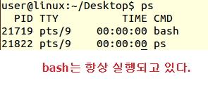

## echo
- printf 역할하는 필수 명령어
- echo hello world
- 인용부호 사용 가능 echo ‘hello world’
- 단축키로 인용부호 찍기 : CTRL 키 누른채로 화살표 누르면 word단위로 움직일 수 있다. (MAC에서는 ALT키)
- 인용 부호는 언제 써야 하는가? 출력 문자에 공백이 적용되게 하기위해서는 인용부호를 쓰고 띄어쓰기하면 적용되어 출력된다.

## tail
-	cat /var/log/kern.log 커널에서 발생되는 로그 데이터 파일
-	cat : 파일의 맨 앞부터 보여주는 명령
-	tail 을 사용하면 log 파일처럼 하위에 기록되는 최신 내용을 확인하고 싶을 때 파일의 뒷부분만 볼 수 있도록 하는 명령어
-	반대로 head도 있다! 앞부분 보여주는 것
-	커서 맨 앞으로 보내는 단축키 : CTRL + A (알파벳 맨 앞)
-	커서 맨 뒤로 보내는 단축키 : CTRL + E (END 따옴)
-	리눅스에서 CTRL + Z 는 프로그램 hold(중단) 기능
-	단축키를 보면 해커의 철학이 보인다. 외우기도 쉽게 만들어 놓음

## Alias(별칭)
-	명령을 단축하는 방법
-	대화형 셸에서만 사용되며 스크립트에서는 사용할 수 없다.
-	alias 별칭=”명령 내용”  
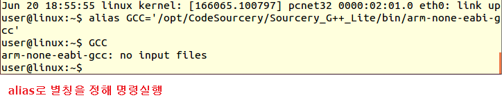
-	설정 후 별칭만 적으면 설정해놓은 명령이 실행됨
-	alias 만 치면 현재 alias로 잡아놓은 것들의 리스트를 볼 수 있다.
-	그런데 터미널을 새창으로 열면 설정해 놓은게 적용이 안된다. -> 따라서 스크립트 파일을 사용해야한다.   

-	subl ~/.bashrc 꼭 기억 해둬야할 피일!! (자동실행 스크립트 파일) 새로운 터미널이 실행될 때마다 실행되는 파일이다.
-	.bashrc를 수정하고 저장한 후에 새로운 터미널을 열 때부터 적용이 된다.!!
-	source ~/.bashrc 스크립트를 실행해주는 명령어를 사용해서 현재 터미널에서부터 적용이 되도록 할 수 있다.

## functions
- 스크립트로 함수를 만들 수 있다.
- function 이름(){}
- 이름만 무르면 함수 실행 된다.

## read
- 변수 등에 저장된 값을 읽어오는 명령어  
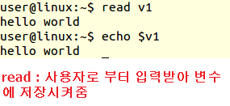
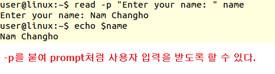
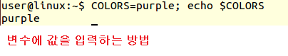
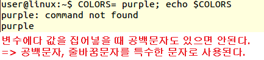
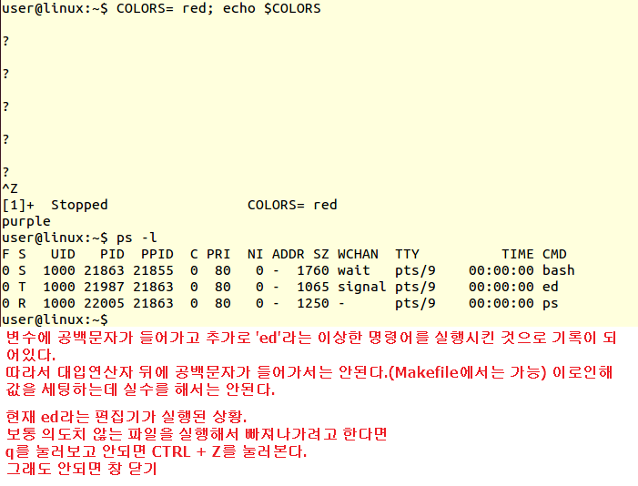

## loop 문
- while 문
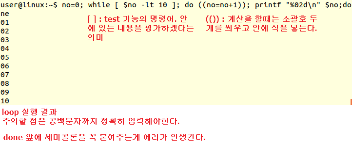
- for 문
    - 확장자 일괄 변경하기.
    - wild card(*)는 파일명령을 하나하나 다 적어준 효과
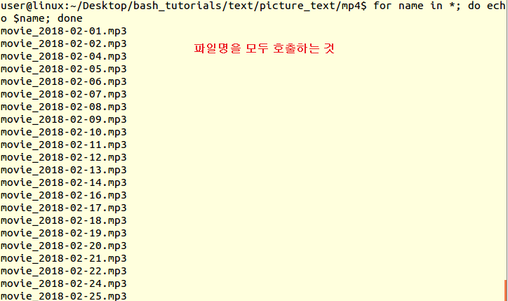
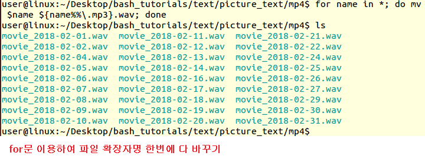

## 스크립트 함수 사용하기
- counline.sh에 파일내의 line 수를 카운트하는 함수를 저장해두고 이를 bash에서 사용해본다.
<counline.sh 함수 작성>
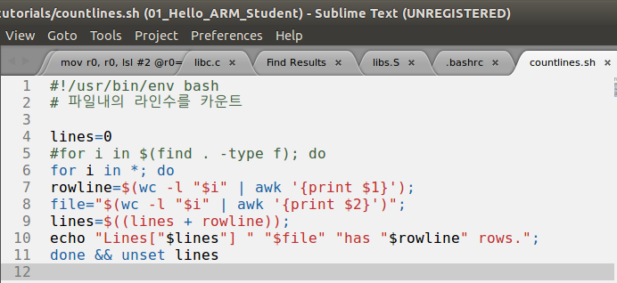
<함수 실행 결과>
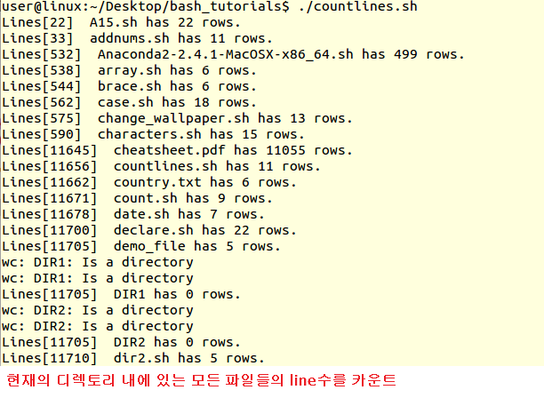

- bash에서 바로 작성된 스크립트 실행시키기
    - 스크립트 상단에 #!/usr/bin/env bash 로 적으면 PATH에 경로 설정이 되어 어디에서든지 스크립트를 실행시킬 수 있다.
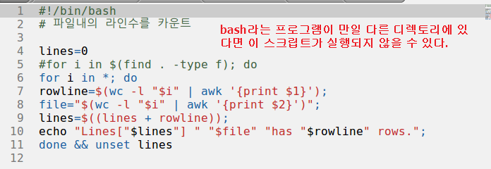
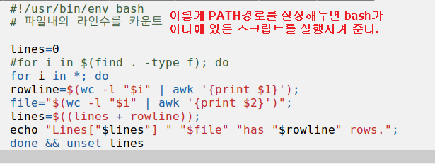

## bash에서 PATH등록
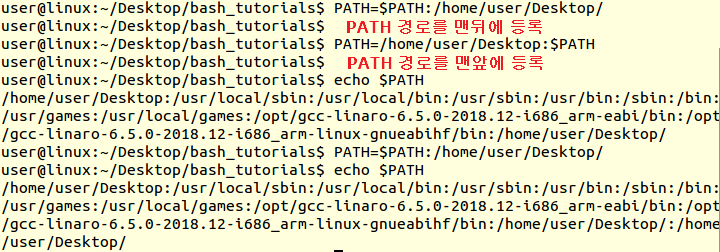
- pwd는 현재 경로를 출력시키는 명령어
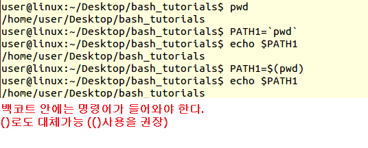

## 특수문자
- 특수문자는 사용하는 위치에 따라 다른 의미로 사용될 수 있다.
- 예) history
    - history를 입력하여 지금까지 입력한 명령어 목록이 나올 때 !359 처럼 !와 인덱스 번호를 넣어주면 그 명령을 다시 사용하게 해준다.
    - !!를 입력하면 가장 최근에 입력한 명령어를 실행해준다.

## 변수
- 글자, 숫자, 밑줄로만 구성된 단어
- 주위에 공백을 쓰면 안된다.
- 사용자가 설정해준 변수외에 내부적이로 이미 설정되어 있는 변수가 있다.
    - 내부 변수에 값을 할당할 경우 본래의 변수 기능이 상실된다. 따라서 사용하지 말 것
- PWD 내부 변수
    - 디렉토리 이동경로 저장
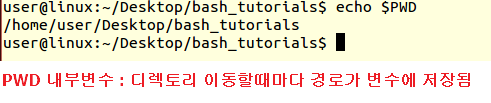
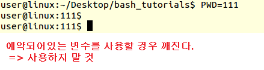
- RANDOM 내부 변수
    - 랜덤 값이 저장  
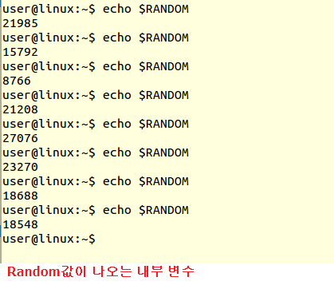
- LINE 내부 변수
    - bash에 적은 line 수가 저장

## 전달인자
- 스크립트에 전달인자를 넘기기
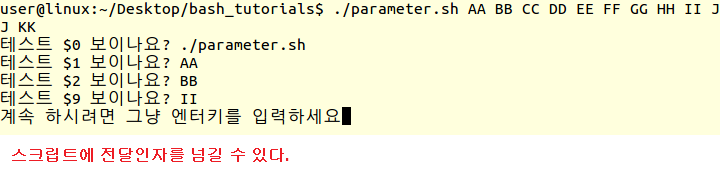
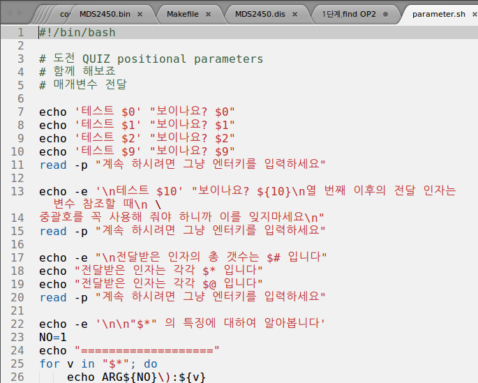

## tr
- 소문자를 대문자로 변환
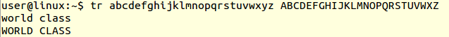
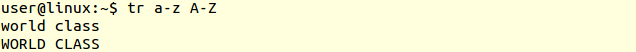
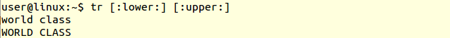

- 암호화에 이용 가능
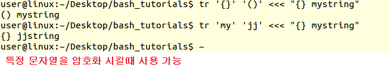

- 문자의 반복 없애기
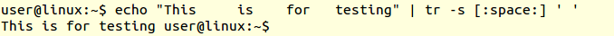

- 지정한 글자 없애기  
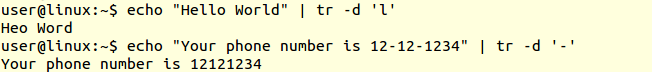

- 지정한 글자만 남기고 없애기  
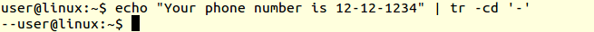

## grep
-	fgrep, egrep, sed (커맨드라인에서 사용하는 단어 검색 표현)
-	단어 검색할 때 표현
-	egrep : 정규표현식 검색
-	grep : 일반, 정규표현식 모두 검색 가능
-	sed : replacement 기능 제공
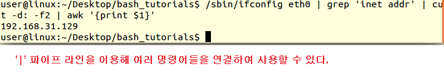  
<원하는 문자열 추출 과정>
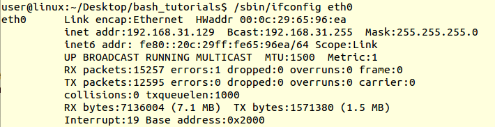
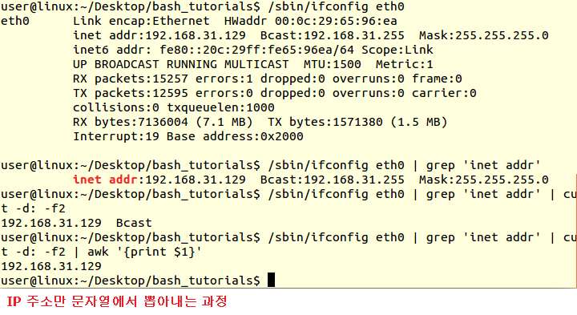

## rm
- 원하는 파일만 남기고 다 지우기
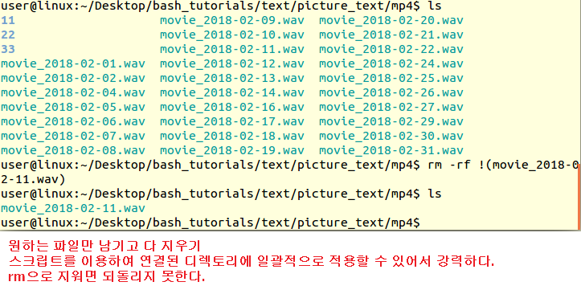

## seq
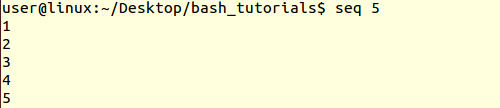

## export
- 중첩 실행될 시에 변수 값을 그대로 상속 받도록 하는 것
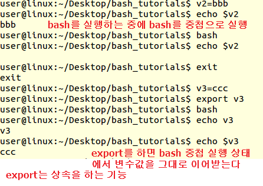

# 정규 표현식 (Regular Expression)
- 문자 추출  
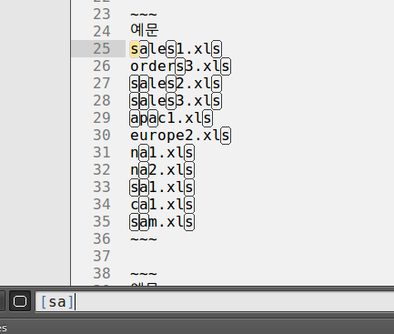
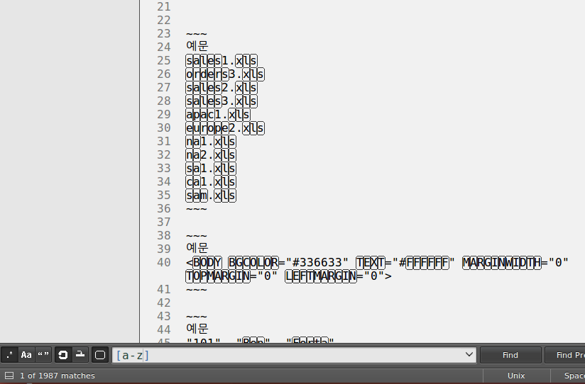

- 파일명 패턴 인식
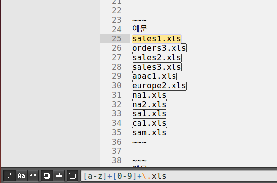
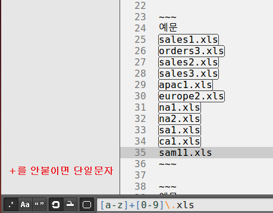

- 파일명 사이에 문자 삽입  
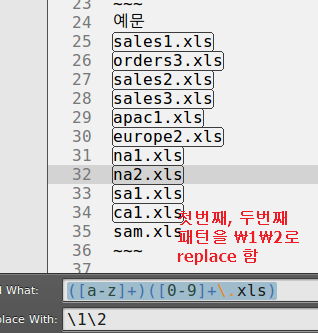
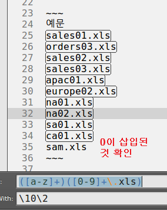

- 데이터 패턴 인식  
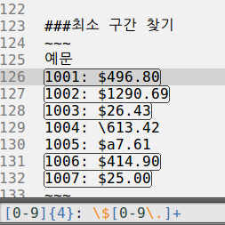
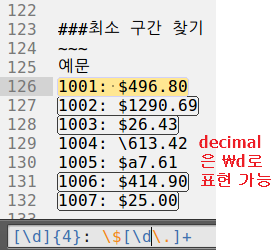

- 함수명 패턴 인식 후 공통된 코드 라인 삽입  
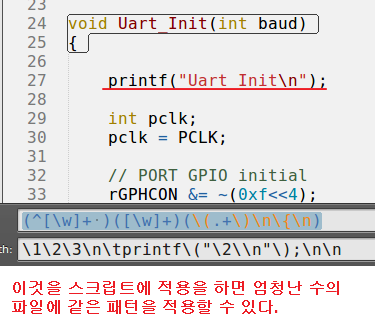

- 스크립트 내에서 정규표현식 사용하기
    - 해커들 또한 정규표현식을 적극 활용하여 shell에 적용시켰다.  

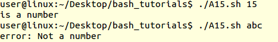