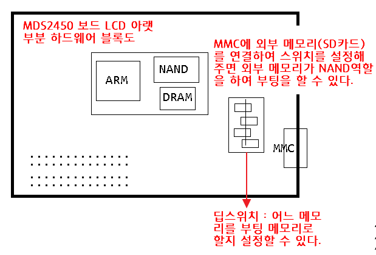

# 1. 가상 머신, PC, ARM 개발 네트워크 환경

# 2. NAND Flash 부팅 과정

- PC에서 프로그램 컴파일 및 실행과정  

- 고전적인 ARM 구조에서의 프로그램 실행, NAND Flash의 필요성  

- NAND Flash의 추가

- NOR Flash를 제거한 구조에서 NAND Flash 프로그램 저장 및 부팅 과정

- NAND Flash 부팅의 원리로 외부 메모리를 부팅 시작점으로 놓을수도 있다.

# 3. 크로스 컴파일러의 필요성 확인

## 3.1 저장된 크로스 컴파일러 설치

- 압축해제  

- 크로스 컴파일러로 컴파일한 파일 b.out 생성  

- PC 컴파일러로 생성된 a.out과 크로스 컴파일러로 생성된 b.out의 파일 특성 비교

