# 표준 라이브러리

## 1. C 표준 라이브러리
- ANSI C에서 시작하여 비슷한 시기에 POSIX에서도 개발됨
- ANSI C가 ISO로 통합되면서 C 표준 라이브러리도 ISO C 라이브러리로 불리기도 함
- 유닉스 시스템의 경우 OS의 일부로 제공 되어짐
- GNU/Linux의 경우 glibc를 표준 라이브러리로 제공
- 시스템 환경이 다양할 수록 표준 라이브러리를 만들기 어렵다.
- 공유 라이브러리 형태로 제공됨

## 2. make & makefile
### 2.1 make란
- 프로그램 빌드 도구
- 어러 파일간의 의존성, 각 파일에 필요한 명령 정의를 통해 *한꺼번에 여러 프로그램 컴파일*
- makefile 이라는 파일에 작성된 문법을 amke가 해석하여 빌드
- 프로직트 중 *수정된 파일만 식별*하여 재 컴파일 가능
- 쉘에서 정의한 환경 변수 값들을 그대로 이용가능

### 2.2 make 규칙
```
target : dependencies
    command // 앞에는 tab 공백 필수(space와 구별)
```
- **target** : command 부분이 실행되어 나온 결과 파일
    - target파일의 예 : 실행파일(ELF), dhqmwprxm vkdlf, tlfgodgkf dortusdml dlfma
- **dependencies** : target을 만들기 위한 입력으로 사ㅛㅇ되는 파일
- command : dependencies의 파일이 target으로 변환되기 위한 명령
    - dependencies의 파일 생성시간(또는 변경된 시간)을 target과 비교하여 dependencies 파일의 시간이 target보다 최근일 경우 실행
    - target 파일이 없을 경우 실행
    - command로 쉘에서 사용 가능한 모든 명령어 사용할 수 있다.

### 2.3 Makefile
```
baz : foo.o bar.o
    gcc -o baz foo.o bar.o
foo.o : foo.c
    gcc -c foo.c
bar.o : bar.c
    gcc -c bar.c
```
- `gcc -o baz foo.o bar.o`
    - baz 실행 파일을 만들기 위한 명령
- `baz: foo.o far.o`
    - baz를 만들기 위해 foo.o, bar.o 필요
    - foo.o, bar.o는 baz를 생성하기 위한 dependecies  
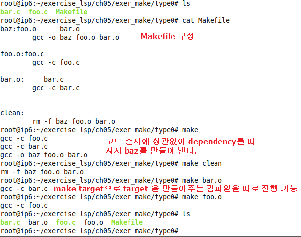

### 2.4 make clean 만들기
- 만들어진 Makefile 뒷부분에 삽입
```
clean:
    rm -f baz foo.o bar.o
```
- 실행 : `make clean`
    - Makefile 내의 clean이라는 target을 찾아 실행

### 2.5 매크로와 라벨
```c
.SUFFIXES = .c .o // 확장자 규칙 기반, 확장자 등록

OBJECTS = main.o read.o write.o
SRCS = main.c read.c write.c

CC = gcc        // 재정의, 써주지 않아도 됨
CFLAGS= -g -c   // 재정의, 써주지 않아도 됨
INC = -I/home/raxis/include // Include Directory
TARGET= test

$(TARGET) : $(OBJECTS)
    $(CC) -o $(TARGET) $(OBJECTS)
.c .o:
    $(CC) $(INC) $(CFLAGS) $< // 내부 매크로
clean :
    rm -rf $(OBJECTS) $(TARGET) core

main.o : io.h main.c
read.o : io.h read.c
write.o : io.h write.c
```
- 매크로와 라벨
    - 반복적으로 사용될 것을 매크로로 지정
    - 매크로는 관습적으로 대문자로 작성
    - 정의된 매크로를 사용할때는 $()를 사용
    - OBJECTS에 컴파일에 사용될 dependecies를 미리 지정
    - 미리 지정된 매크로 : CC, CFLAGS

- 확장자 규칙
    - 파일 확장자에 맞게 적잘한 연산을 수행시키는 규칙
    - .c 파일은 컴파일, 링크를 거쳐 실행파일 생성
        |.c|->|.o|->|.out|
        |:---:|:---:|:---:|:---:|:---:|
        |   |(컴파일)|   |(링크)|   |

- .SUFFIX= .c .o
    - make 파일에게 주의 깊게 처리할 파일들의 확장자를 등록해 준다.
    - <u>TARGET이 만들어지는 과정에서 .o 형성되어 .out 파일로 컴파일 되기전에 .c파일이 .o파일로 컴파일 되는 과정을 알아서 수행시켜 올려주도록 한 것</u>

- 내부 매크로
    - $@ : target 파일
    - $< : dependency 중 최근에 갱신될 파일


- macro 형식 바꾸기
    - 형식 : $(macro_name:old=new)

- Auto-dependency
    - dep라는 target이 있고 dependency가 없는 형태에서 gccmakedep는 최종 컴파일 단계에 필요한 dependency를 알아서 컴파일 과정을 거쳐 만들어 최종 target 생성에 전달해준다.
```c
.SUFFIXES = .c .o
CFLAGS= -O2 -g

OBJS = amin.o read.o write.o
SRCS =$(OBJS:.o=.c) // macro 형식 바꾸기

test:$(OBJS)
    $(CC) -o test $(OBJS)
dep:
    gccmakedep$(SRCS)
```

- make all : 결과 파일이 여러 개 필요할 때
    - target을 적어주기 전 맨앞에 all 적어준다.
    - 그냥 make를 하면 all이 실행되는 것
```c
all: test1 test2 test3
test1:$(OBJ1)
    $(CC) -o test1 $(OBJS1)
    .
    .
    .
```

- make의 중요 옵션
    - `-C dir` : 당장의 Makefile을 실행하지 않고 하위 dir에 컴파일이 필요한 파일들이 있는 깊이까지 들어가 모두 컴파일 수행.
        - 하위 dir에 있는 파일들이 컴파일 된 .o파일들이 한데 모여 .a(archive)파일이 만들어진다.
    - `-f filename` : filename에 해당하는 파일을 Makefile로 간주한다. (Makefile의 이름이 Makefile이 아니라 다른 이름이 되는 것)  
    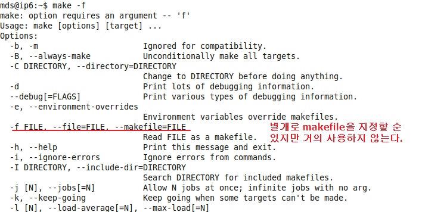

## 3. gdb
- 리눅스에서 사용가능한 디버거
- 기능은 막강하나 쓰기가 어렵다.  
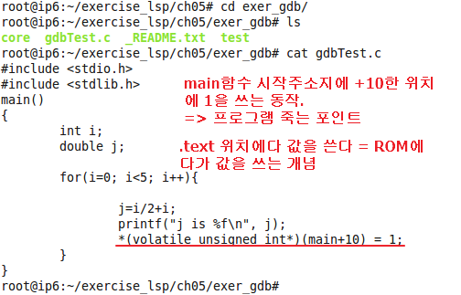
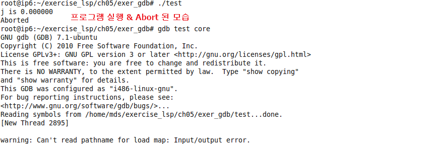
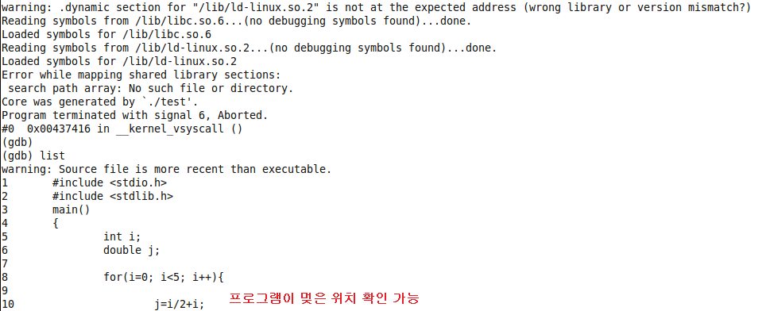


# 정적, 공유, 동적 라이브러리

## 1. 라이브러리
- 함수나 클래스를 포함하고 있는 컴파일된 파일
- 자주 사용되는 기능들을 main함수에서 분리시켜서 프로그램 유지 보수 및 디버깅을 쉽게 할 수 있다.

## 2. 라이브러리의 종류
> 정적, 동적, 고유 라이브러리는 적재 시간에 따른 분류이다.

- 정적 라이브러리
    - 최종 실행파일(ELF, .out)에 같이 포함되어 적재된다.
    - object fil의 묶음 : archive(.a 확장자)파일
    - 링크시 적재되므로 유연성이 떨어진다. 바이너리 크기가 커지는 문제점이 있다.
- 동적 라이브러리
    - 프로그램이 실행되다가 필요시 적재, 플러그인 모듈 구현에 적합
        - .out에 포함되지 않는다
    - 라이브러리를 선택적으로 적재/해제 지정 가능
- 공유 라이브러리 (가장 많이 사용)
    - 프로그램이 시작될 때 적재
    - 한번 로딩되고 나면 다른 프로그램에 의해서도 사용가능
    - 장점 : 컴파일시 적재되지 않기 떄문에 정적 라이브러리와 비교해엇 프로그램 사이즈는 작아짐
    - 단점 : 라이브러리 적재 시간은 더 걸릴 수 있음

### 2.1 라이브러리 사용 실습

1. 정적 라이브러리  
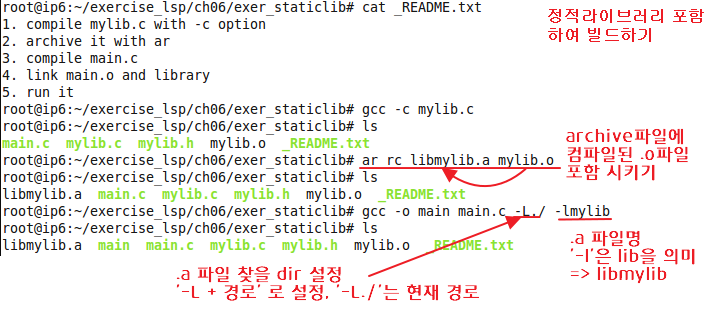
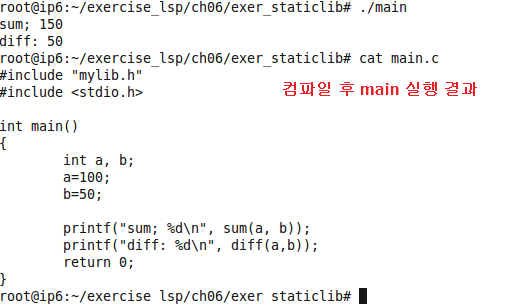

2. 공유 라이브러리  
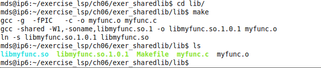
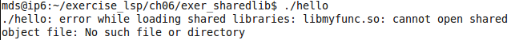
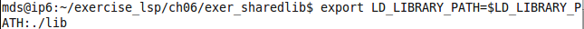

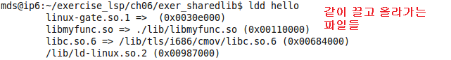