# System Call

## 1. 메모리 구역
<가상메모리 구역>
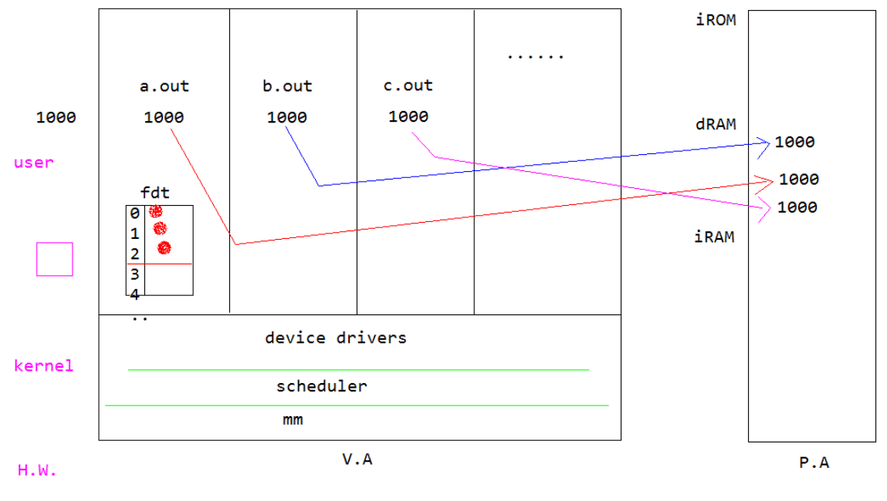

- 커널이 사용하는 영역과 User 프로그램이 사용하는 영역으로 구분되어 있다.
- User 영역
    - 프로세스 마다 각자 다른 가상 메모리 영역을 사용한다. 따라서 메모리 주소가 같더라도 물리 주소로 변환 될때는 전혀 다른 메모리 주소로 할당된다.
    - physical memory 주소
        - iROM  : 0번지
        - RAM : 3000만 번지
        - iRAM : 4000만 번지
- kernel 영역
    - Device driver, Scheduler, Memory manager로 구성
    - 각기 다른 가상주소 값을 가진다.

## 2. 커널 자원으로 시스템 접근 단일화
- Interrupt
    - 리눅스 상의 virtual File System을 통해 시스템 자원 접근
- 신뢰성 확보
    - System call을 통해서만 접근 가능하도록한다.
        - 잘못된 프로그램에 의한 오작동 예방


- Kernel mode vs User mode 권한
    - Kernel mode : 모든 접근이 허용됨
    - User mode : H/W 및 메모리로의 접근이 제한됨(가상화, 추상화 된 것만 본다.)
        


- Application vs Kernel 작업 수행
    - Application : 처음부터 순차적으로 실행
        - User application은 H/W 접근할 권한이 없으므로 kernel level에 부탁하여 하드웨어가 동작해게 해야한다. (printf 요청할 경우 stdout에 요청, kernel 입장에서는 stdout은 HW(UART 등)가 된다.)
            - printf의 경우 API가 아니라 standard library에 포함되어 있음. library에 API를 불러오는 함수가 들어 있고 그 안에서 system call이 이루어 진다.
        - application 입장에서 kernel에 부탁하기 위해서는 interrupt를 사용할 수 밖에 없다.
        - 이러한 권한 분리로 인해 신뢰성 확보
    - Kernel : system call이나 interrupt를 처리하기 위해 비동기적으로 실행
        - application에서 system call을 하여 kernel에 service를 부탁한다.


## 3. System call vs API
- System call
    - 권한이 없는 user가 권한을 가진 supervisor에 요청을하는 것
    - user level에서의 요청 뿐만 아니라 superviser(SVC)에서도 특정 코드가 없다면 다른 개체에 요청할 수 있다.
    - Platform 마다 다르기 때문에 주의 필요
    - OS가 향상된 기능의 새로운 System call을 제공하게 되면 전반적인 update 필요
- API
    - 거의 동일한 API를 사용해서 code migration 작업이 용이
        - OS의 update에 맞춰서 일반적으로 update된 API가 존재하기 때문에

## 4. System call이 발생하는 과정
1. System call
2. library 함수 호출
3. 함수의 인자값 처리 및 레지스터에 시스템 콜 등록
4. SWI 발생
5. Processor가 커널 모드(SVC)로 전환
6. 커널이 Interrupt에 대한 system call 루틴을 호출
7. 현재 레지스터 값들을 스택에 저장 (prologue : 돌아가기 위한 내용 저장)
8. 넘겨 받은 인자값들 확인
9. system call 루틴 실행
10. 스택에 저장된 레지스터값들 복구 (epilogue)
11. processor가 사용자 모드(User)로 전환
12. system call 함수로 부터 return
> System call은 overhead를 고려해야한다.
> - overhead : 커널로 들어가서 서비스를 받아내는 일련의 과정  
> - 일반적인 함수 호출은 루틴만 바로 실행하면되서 overhead가 발생하지 않는다.

## 5. System calls for I/O
- OS가 I/O를 컨트롤하는 이유?
    - Safety : 동시에 여러 개의 프로그램이 실행 중일 수 있기 때문에 프로그램의 이상으로 인한 충돌이나 이상 작동이 발생하는 것을 예방해야 함
    - Fairness : 동일한 장치를 사용하는 프로그램들이 균등하게 해당 장치를 사용할 수 있어야 함

## 6. ARM에서의 system call
- SWI 명령으로 privileged mode로 진입 -> SWI 핸들러 인자로 넘어오는 콜번호 처리
1. Fork() 실행 (process 생성)
2. SWI 0x02 정도의 간단한 처리
3. SW interrupt 발생
4. Exception vector table에서 SWI 명령에 대한 핸들러를 찾아서 진입
5. System call vector table
6. 핸들러 함수 주소 계산 : 0x02 * 4
7. sys_fork() 함수로 분기
8. 실질적인 fork 작업 수행


# FILE I/O

## 1. 모든것은 파일이다.
- 유닉스에서는 모든것을 파일로 취급한다.
    - 하드디스크, 디렉토리, 네트워크 카드, 사운드 카드, 키보드, 마우스
- 파일을 오픈, 읽기, 쓰기, 닫기 처럼 모든 것을 파일과 같은 매커니즘으로 처리
- 파일의 종류
    - 일반파일(jpg, mp3, pdf, ...)
    - 디렉토리
    - symbolic link
    - hard link
    - device : 프린터, 사운드카드
    - socket
    - PIPE
- 파일 사용 순서
    1. open
    2. read/write
    3. close
- File open system call
    - 파일의 존재여부 확인
    - 파일이 존재하지 않을 경우 생성여부 결정
    - 파일에 대한 권한 확인
- File descripter
    - 각 파일이 생성 될 떄 갖는 고유 번호
    - 파일 open(); 실행시 리턴값으로 받는 int 형 정수 값
    - 0이상의 정수
    - 0보다 작은 결과를 리턴 받는 경우 열기 실패
    - stdin, stdout, stder이 기본적으로 각각 0, 1, 2번으로 할당되어있다.
        - 새로 open한 파일은 3번 부터 할당 됨
- 파일 구성 정보
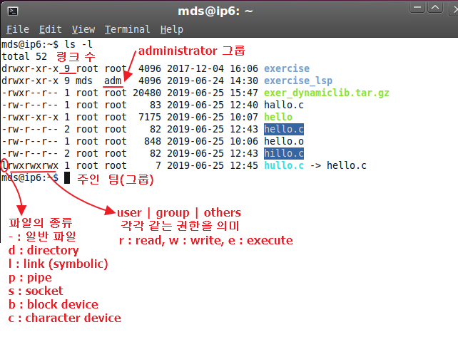

## 2. 실습
- 파일 열기 (생성하기)
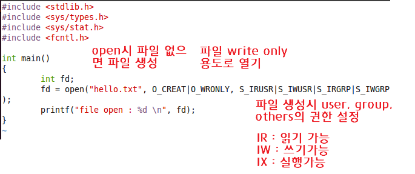
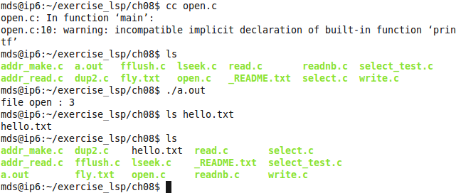

- 파일 읽기
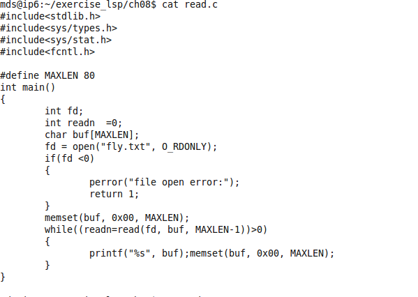
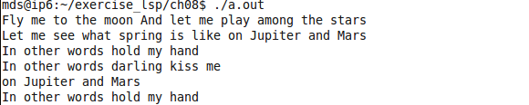

- umask 역할
    - 파일 권한은 R = 4, W = 2, X = 1의 값으로 간주된다.
    - umask 값에 따라 user, group, others의 권한에 제한을 둘 수 있다.
    - ex) 파일을 User권한 = rw(4+2=6), group권한 = rw(6), others권한 = rw(6)으로 설정하여 생성해도 umask 값이 0022라면 권한 값이 644가 된다.
    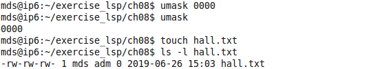
    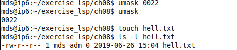

- 파일 쓰기
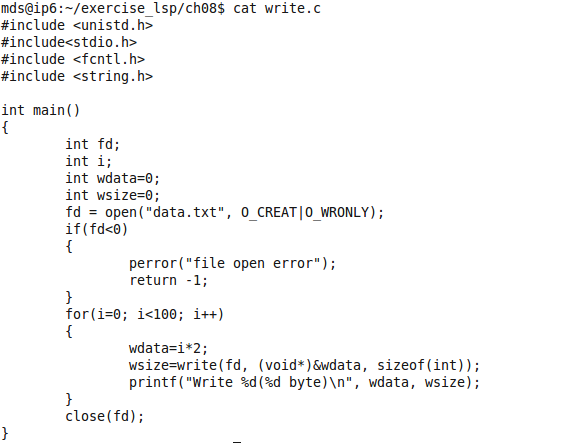
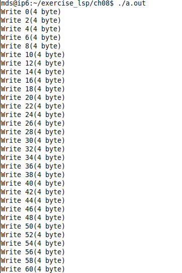
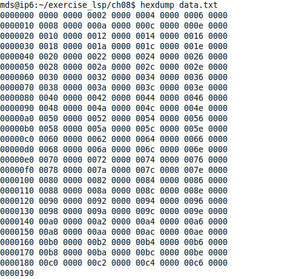

- 구조체 데이터 읽고 쓰기
```c
#include <stdlib.h>
#include <sys/types.h>
#include <sys/stat.h>
#include <fcntl.h>
#include <string.h>
#include <stdio.h>

struct userInfo
{
  char name[28];
  int age;
  int sex;
  char hobby[28];
};

void makeUserInfo(struct userInfo *uinfo,
  char *name, // 이름
  int age,    // 나이
  int sex,    // 성 (남: 0, 여: 1)
  char *hobby) // 취미
{
  memset((void *)uinfo, 0x00, sizeof(struct userInfo));
  strcpy(uinfo->name, name);
  uinfo->age = age;
  uinfo->sex = sex;
  strcpy(uinfo->hobby, hobby);
}

int main()
{
  int fd;
  struct userInfo myAddrBook;
  fd = open("hello.txt", O_CREAT|O_WRONLY, S_IRUSR|S_IWUSR|S_IRGRP|S_IWGRP);
  if (fd < 0)
  {
	perror("file open error");
	return 1;
  }

  makeUserInfo((void *)&myAddrBook, "user1", 19, 0, "programming");
  write(fd, (void *)&myAddrBook, sizeof(myAddrBook));

  makeUserInfo((void *)&myAddrBook, "user2", 22, 1, "playing games");
  write(fd, (void *)&myAddrBook, sizeof(myAddrBook));

  makeUserInfo((void *)&myAddrBook, "user3", 33, 1, "playing soccer");
  write(fd, (void *)&myAddrBook, sizeof(myAddrBook));

  close(fd);
  return 0;
}
```
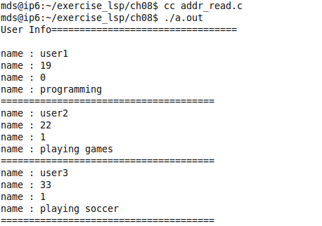

