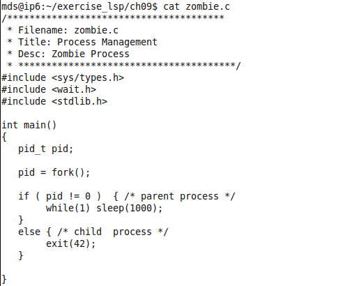
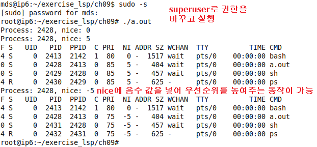

# 1. 프로세스

## 1.1 프로세스 기본
1. 프로세스 정의 및 종류
    - 메모리로 로드되어 실행되는 모든 프로그램
    - User process : user code 실행
    - Kernel process : OS code 실행
    - 프로세스의 모드
        - 유저 모드 : 사용자 권한으로 실행, 시스템 자원(OS, 하드웨어)에 접근 불가
        - 커널 모드 : 커널 영역에서 동작, 시스템 자원에 접근하기 위한 용도로 시스템 권한으로 실행

2. CPU관리와 프로세스 관리
- 프로세스 관리 : OS 담당
- CPU 관리 : 스케줄러 담당
    - 실행해야할 어플리케이션은 여러개지만 이들을 실행시켜주는 CPU는 하나다. 따라서 여러개의 어플리케이션(프로세스)이 동시에 실행될 수 있도록 프로세스들을 효율적으로 CPU로 load/unload 해주는 역할을 스케줄러가 담당

3. Reentrant 프로그램
- 같은 프로세스가 다른 프로세서에서 동작하는 것 의미
- 각 프로세스의 프로그램 코드(.text)는 같지만 .data, .stack만 다른 것을 의미
- .stack은 주로 서브루틴 호출 과정을 추적 (PCB)

<ps -ef 명령어로 리눅스 상에 실행 중인 프로세스 목록 확인>  

- PID : Process ID
- PPID : Parent Process ID
- PID 1번 init : 모든 프로세스의 어머니이다. user 영역에서 동작
- PID 2번 kthreadd : Kernel Thread Demon, 꺾은쇠 `[]`로 묶인 것들은 커널 영역에서 동작하는 프로세스들을 의미

4. 리눅스의 프로세스 상태
- task_struct의 state 필드에 저장
- state 필드는 Flag 배열로 구성되며 각 flag는 프로세스 상태를 나타냄
    - TASK_RUNNIG
        - 프로세스가 실행 중 이거나 시행 되기를 기다리는 상태
    - TASK_INTERRUPTIBLE
        - 프로세스가 어떠한 조건을 만족할 때까지 중단된 상태
        - 조건 : 하드웨어 인터럽트, 자원, 시그널
        - ex) printer 사용 대기를 하다가 포기하거나 혹은 다른 요청이 들어오면 되돌아 갈 수 있다.
    - TASK_UNITERRUPTIBLE
        - 어떤 특정한 조건을 기다리는 도중 어떠한 인터럽트도 허용하지 않는 상태
        - ex) 특정 인터럽트 동작을 시작하면 그 것이 무조건 끝나기 전까지는 다른 어떤 인터럽트도 허용하지 않음
    - TASK_STOPPED
        - 프로세스가 중단됨
    - TASK_ZOMBIE
        - 프로세스가 종료 되었지만 어떤 이유에 의해 TASK 벡터에 task_struct 정보가 남아 있는 상태


> 리눅스 명령어  
> - Ctrl + Z : 프로그램 중단  
> - fg : foreground, 프로그램이 제일 Front 위치 레이어로 올라와 실행되는 것. 사용자와 상호작용할 수 있음  
> - bg : background, 프로그램이 background에서 실행되므로 사용자가 시각적으로 실행 상태를 확인할 수 없음  

5. 프로세스 관련 함수와 자식 프로세스
- Fork : 부모 프로세스를 복사하여 자식 프로세스 생성
- Wait : 자식 프로세스가 종료될 떄까지 기다림
- Exit : 프로세스를 종료시킴
    - Zombie process : 실행은 종료되었지만, 아직 삭제되지 않은 프로세스

6. Process context
- 실행 중인 프로세스의 순간 상태에 대한 스냅샷
- 사용자, 레지스터, 시스템 측면에서 고려
    - 사용자 : 사용자 주소공간의 정보(text, data, stack, shared memory)
    - 레지스터 : pc, cpsr, sp, 범용 레지스터
    - 시스템 : 프로세스 상태, 식별자 ID, 페이지 테이블, 커널 스택


## 1.2 프로세스 생성/종료

1. fork()
    - 리눅스의 fork()는 *시스템 콜*을 이용하여 구현
    - 공유할 자원을 지정할 수 있는 플래그 사용
    - 프로세스 생성의 대부분은 copy_process() 에서 수행  
  
  

<fork 실습 예제>  
  
<실행 결과>  
  
- 첫번째 결과
    - 자식 프로세스가 정상 실행되고 for문에 갖혀 프로세스가 종료되지 않고 있다.
    - 부모 프로세스는 wait 함수로 인해 자식 프로세스가 죽었다는 sigchild를 전달 받기 전에 대기하게 된다.
    - 자식 프로세스가 for문 때문에 종료되지 못하므로 Child Complete 문구를 출력하지 못하고 있다
- 두번쨰 결과
    - for문을 없애준 후 자식 프로세스가 정상 종료된 후 부모 프로세스도 정상적으로 종료된 것을 확인할 수 있다.


<fork()로 새 프로세스 생성>


2. exec()
- PID, PPID의 번호는 변경없이 그대로 유지.
- 실행하는 코드와 자료, 스택이 새로운 내용으로 교체된다
- 즉, 메모리 영역에 다른 프로세스 코드가 덮어씌워지는 것
- *부모와 다르다.*  
  

## 1.3 프로세스 상태

1. 좀비(Zombie) 프로세스
    - 실행이 종료되었지만, 부모 프로세스가 반환 코드를 아직 받지 못해 테이블 엔트리에 정보가 남아 있는 프로세스
 2. 고아(Orphan) 프로세스
    - 부모 프로세스가 먼저 종료된 경우
    - <u>모든 고아 프로세스는 자동적으로 *init의 상속되어 "양자"가 되어* 안전하게 종료된다.</u>

<Zombie 프로세스 예제>  
  
<실행 결과>  
  

<Ophan 프로세스 예제>  
  
<실행 결과>   
   

## 1.4 선점형 커널

1. 선점형 커널과 우선순위 프로세스 종류
- Linux는 시스템 콜에 의해 우선순위가 높은 Process가 kernel mode에 진입한 상태에서는 프로세서를 선점할 수 있는 '선점형 커널' (Preemptive kernel)이다.

- 동적 우선 순위 프로세스 : CFS(Completely Fair scheduler)
    - 우선순위를 반영하여 공평하게 스케줄 할당
    - 하지만 우선순위에 따라 무조건적인 독점을 하진 않는다
- 정적 우선 순위 프로세스 : RT(Real Time)
    - 무조건 우선순위 독점 서열화
> 임베디드는 Real time 기능이 필요하다. 그래서 리눅스에도 기능을 첨부했다.  
하지만 Real time 성능이 좋지 않는게 Linux의 단점 중 하나다.  
임베디드에서 Real time 기능은 OS가 얼마나 잘 받쳐주냐가 중요하다.

2. Priority
- `ps -l` 명령어로 프로세스 목록을 봤을 떄 `PRI`가 해당 프로세스의 priority를 나타낸다.
- CFS (Non-realtime Priority) 
    - 직접 Nice 값을 설정하여 프로세스를 실행하면 그 값에 따라 PRI값을 조정할 수 있다.
        - **우선순위를 낮추는 건 user mode에서도 가능하지만 우선순위를 높이는 건 superuser mode에서만 가능하다.**
    - PRI 값의 기준은 80으로 잡으며 PRI = 80 + NI(Nice)가 된다.
    - PRI 값 범위는 -40 ~ 99 이므로 숫자가 작을수록 우선순위가 높다.
    - <u>스캐줄링 정책 그룹 : SCHED_OTHERS</u>
- Realtime
    - CFS 우선순위들 보다 높은 고정 우선 순위 사용된다.
    - 파라미터 설정 함수를 통해 우선순위 초기화 가능
    - CFS가 Nice값을 이용해 동적으로 우선순이 변경이 가능한 반면 우선순위가 고정적이다.
    - <u>스캐줄링 정책 그룹 : SCHED_FIFO, SCHED_RR</u>
        - SCHED_FIFO : 가장 높은 우선순위를 갖는 이상 끝까지 CPU 점유 가능
        - SCHED_RR : 같은 우선순위를 가질 경우 Round Robin, 번갈아 가면서 실행  


- 동적 우선순위 프로세스 실습  


<실행 결과>  



- 정적 우선순위 프로세스 파라미터 변경 실습  


- 동적 우선순위 프로세스 스케줄링 특성 관찰
    - 우선순위 기반으로 적절히 스케줄링 (독점 아님)  


## 1.5 프로세스 Descriptor

1. 프로세스 제어 블럭 (Process Control Block)
    - 프로세스의 모든 정적 및 동적 정보를 가지고 있다.
    - 커널은 PCB를 통해 프로세스를 관리한다.
    - PCB가 가지는 것들 : 프로세스 ID, 프로세스 상태, 프로그램 카운터, CPU 레지스터들, CPU 스케줄 정보, 메모리 관리 정보, 계정 정보, 입출력 상태 정보

2. 프로세스 정보 관리
    - 프로세스가 생성되면 task_struct 구조체를 통해 프로세스의 모든 정보를 저장하고 관리

3. 프로세스 스택
    - cat /proc/1/maps
        - init 프로세스가 유저 공간에서 사용하는 메모리
        - proc은 파일이 들어있는 폴더가 아니라 디렉토리 형태로 프로세스 정보가 들어있다.
        - pmap 명령어로 볼 수 있는 정보가 들어있음
    - 프로세스 별로 자신의 프로세스 스택이 존재

## 1.6 프로세스 contect switching

1. 문맥 교환
- CPU가 한 process에서 다른 process로 switch될 떄
    - 이전 프로세스의 상태(CPU와 메모리 상태(PCB정보))를 저장
    - 이전에 저장되어 있었던 새로운 프로세스의 상태(CPU와 메모리 상태(PCB정보))를 호출

2. 문맥 교환 일어나는 경우
    - 프로세스 자신이 잠들 때
    - 프로세스가 exit할 때
    - 시스템 호출 / 인터럽트 핸들러 / 예외 핸들러를 마치고 사용자 모드로 복귀할 때, 실행될 가장 적당한 프로세스가 아닐 때

# 2. 스레드

## 2.1 스레드 개념 및 특징

1. 스레드 출현
- 원래 리눅스엔 프로세스 외에 스레드라는 개념이 없었다.
- 유닉스가 스레드를 만들면서 POSIX에도 포함되었다.
- 유닉스를 추종하는게 리눅스기 떄문에 어쩔 수 없이 도입되었다.
- 병렬처리를 프로세스로하는 대신 가벼운 스레드의 필요성이 있었다.
- <u>그래서 리눅스는 스레드를 프로세스의 한 유형으로 구분한다. </u>
- Light Weight Process - Thread

2. 스레드 장점 : 저렴한 비용
- 새로운 스레드 생성에 따른 새로운 주소공간, 전역 데이터, 프로그램 코드 또는 운영체제의 리소스가 필요치 않기 때문에 운영체제 관점에서도 적은 리소스를 사용
    - 프로세스 객체 내에서 여려개의 스레드가 존재하므로 그 안의 스레드끼리는 주소번지를 공유한다. 따라서 공통의 데이터를 공유할 수 있고 프로세스간의 통신이 필요없다.
  
  

## 2.2 스래드 생성과 삭제

- 3개의 스레드 생성 예제  
  
<실행 결과>  
  

- 3개의 스레드가 실행되고 리더 스레드가 while(1)에 잡혀 계속 살아있는 모습  
  

- main문에 while(1)을 제거하고 실행 스레드에 while(1)을 적용
    - 3개의 자식 스레드가 종료되지 않아 살아있게 되고 리더 스레드가 먼저 죽은 상태
    - 3개의 자식 스레드가 살아있으므로 프로세스가 종료되지 않았으나 리더 스레드는 종료 되었으므로 zombie 스레드 상태가 된 것 확인  
  
  

## 2.3 pthread
- 스레드 속성 API

```c
#include <stdio.h>
#include <pthread.h>
#include <sched.h>
#include <unistd.h>
#include <sys/types.h>

int thread_args[3] = { 0, 1, 2 };

void* Thread( void *arg )
{
    int i;
//    nice(10); 	// only for SCHED_NORMAL
	for ( i=0; i<100; i++ ){
        printf( "%d", *(int*)arg);
    }

	fflush(stdout);	// try if you have not displayed 2s all enough !
	
	//system("ps -l -L ");

	sleep(100);	//sleep for probe

    pthread_exit(0);  
}

int main( void ) {
    int i;
    pthread_t threads[3];
	
	int policy;
	
	
 	pid_t mypid;
	
    /*TODO: thread attribute variable here */
    pthread_attr_t  thread_attrs;

    /*TODO: thread schedule parameter here */
    struct sched_param  param;

	mypid = getpid();

	policy = sched_getscheduler(0);	// get policy of self
	printf("current policy is : %s \n", (policy==0) ? "SCHED_NORMAL" : (policy==1) ? "SCHED_FIFO" :(policy==2) ? "SCHED_RR" : "else" );
	
/*
#define SCHED_NORMAL            0
#define SCHED_FIFO              1
#define SCHED_RR                2
#define SCHED_BATCH             3
*/	

#if 1
	param.sched_priority = 30;	/*	1 - 99 */
	sched_setscheduler(mypid, SCHED_FIFO, &param);	

	policy = sched_getscheduler(0);	// get policy of self
	printf("current policy is : %s \n", (policy==0) ? "SCHED_NORMAL" : (policy==1) ? "SCHED_FIFO" :(policy==2) ? "SCHED_RR" : "else" );
#endif	
	
	
    for ( i=0; i<3; i++ ) {
		
#if 1

	/*
		2 options of  : inherit( default: follow Mom's ) or explicit ( my own )
	**/

	
	/*TODO: initialize thread atrribute variable here */ 
        pthread_attr_init( &thread_attrs );

	/*TODO: EXPLICIT */
//	pthread_attr_setinheritsched(&thread_attrs, PTHREAD_EXPLICIT_SCHED);

        /*TODO: set schedule policy : round-robin here */ 
        pthread_attr_setschedpolicy( &thread_attrs, SCHED_FIFO );  /* you can't change under inherit. just follow leader thread's **/

        /*TODO: set thread priority : 15 */   /* you can't change under inherit. just follow leader thread's **/
        param.sched_priority = 15;
        pthread_attr_setschedparam( &thread_attrs, &param );
#endif
        pthread_create( &threads[i], 
                        &thread_attrs, 
                        ( void* (*)(void*) )Thread, 
                        &thread_args[i] );

    }

    
	system("ps -l -L ");
	while(1)sleep(1);
    pthread_exit(0); 
}
```
  


- pthread_join 실습  


  

### pthread_exit에 대한 추가 설명
> pthread_exit() 함수는 push되었으나 아직 pop 되지 않은 모든 수행 취소 정화 처리기(cancellation cleanup handler)를 차례로 pop해서 수행하고 스레드 고유 데이터의 소멸자를 호출한다.
- 여기서 설명하는 것은 cleanup pop은 아래의 경우에 실행되게 된다.
    - cancel request 받을때
    - pthread_exit했을때
    - cleanup_pop(1) 했을 때 
- pthread_cancel은 설정에 따라 cleanup이 되지 않은 상태에서 종료될 수 있다.


### 프로세스 및 스레드에서 종료문
- exit 
    - 스레드에서든 프로세스에서든 exit을 실행하면 포함하고 있는 프로세스(테스크) 자체를 종료시켜 버린다.
- return
    - 스레드 내 : pthread_exit()와 같다.
    - 프로세스 내 : exit()와 같다. 스레드가 종료되지 않은 상태라도 프로세스 종료시켜버림

### 프로세스 종료의 위험성(pthread_cancel)
- pthread_join을 통해 thread specific resources를 해제해주지 않고 프로세스가 종료되면 자원 누수가 발생한다.

> 프로세스와 스레드의 자원
> - process(system) resources : 파일, 파일 안닫고 종료하면 프로세스가 죽을때 함께 사라진다.
> - thread specific resources : 프로세스는 모르고 스레드 자체적인 자원 같은 것 예) malloc

- pthread_join이 자식 스레드가 갖고 있던 File Descripter Table(FDT), .stack 같은 프로세스 리소스들을 해제해준다.
- pthread_join이 실행되지 않으면 스레드가 죽더라도 프로세스가 끝날 때까지 프로세스 리소스들이 남아있다.
    - 스레드가 detached 상태로 독립적이면 pthread_join에 의존하지 않고 해당 자원을 제거하고 사라진다.

### pthread_cancel
- cancellation은 한 스레드가 다른 스레드를 종료시킬 수 있는 메커니즘이다. 즉, 스레드가 다른 스레드에게 취소 요청을 보낼 수 있다.
- cancellation 요청에 따른 해당 스레드 반응
    - 요청 무시 (cancel disabled)
    - 즉시 요청 처리 (enabled - aync)
    - cancellation point까지 처리 미루기  (enabled - differed)


### thread cancellation 설정
- cancel disabled 스레드 설정 : ptread_cancel요청해도 종료하지 않는다.
- enabled - differed : pthread_cancel 명령이 시그널 형태로 날라간다. =(cancel request) 이 명령 신호가 전달되어도 설정한 안전한 point에서 실행 중일 때만 종료를 수행함
    - 안전한 point(cancelation point)는 pthread_testcancel()같은 함수로 임의적으로 설정해준 point에서만 cancel을 진행한다.
    - 스레드가 cancel clean up stack을 만들어 놓는다. 종료시에 무조건 처리하고 나가야할 명령들을 해당 stack에 넣어 둔다. push, pop하는 함수가 따로 있다.
        - pthread_cleanup_push(freefunc() (넣고자하는 함수의 포인터))
        - pthread_cleanup_pop(n)
        - free 함수를 malloc 실행하고 바로 push해두고 free해야할 시점에 pop을 입력해두면 알아서 stack에서 나오면서 해당 함수가 실행된다.
- enabled - async : cancel 명령 전달되면 스레드 상황 상관없이 죽는다. 
    - cancelation point라는게 따로 없다.


예제
```c
#include <pthread.h>
#include <unistd.h>
#include <stdlib.h>
#include <stdio.h>
#include <sys/time.h>

// 쓰레드 종료시 호출될 함수
void clean_up(void *);

// 쓰레드 함수
void *thread_func(void *);

pthread_cond_t cond = PTHREAD_COND_INITIALIZER;
pthread_mutex_t lmu = PTHREAD_MUTEX_INITIALIZER;

int main(int argc, char **argv)
{
    pthread_t pt;
    pthread_create(&pt, NULL, thread_func, NULL);
    
    // 생성된 쓰레드 pt에 취소 요청을 보낸다.
    pthread_cancel(pt);

    // 5초를 쉰 후에 시그널을 보낸다.
    sleep(5);
    pthread_cond_signal(&cond);
    
    // join후 종료한다.
    pthread_join(pt, NULL);
    printf("exit\n");
    exit(1);
}   
    
// 쓰레드 종료시 효출될 함수
// 여기에 자원해제루틴을 입력할 수 있을 것이다.
void clean_up(void *arg)
{
    printf("Thread cancel Clean_up function\n");
}
    
void *thread_func(void *arg)
{
    // DISABLE 상태다. 
    // 쓰레드에 대한 취소요청을 무시한다. 
    pthread_setcancelstate(PTHREAD_CANCEL_DISABLE, NULL);
    
    // 쓰레드 종료시 호출될 함수 등록
    pthread_cleanup_push(clean_up, (void *)NULL);

    pthread_mutex_lock(&lmu);

    printf("THREAD cond wait\n");
    pthread_cond_wait(&cond, &lmu);
    printf("GET COND SIGNAL\n");

    pthread_mutex_unlock(&lmu);

    printf("EXIT\n");
    // 스레드 종료시 stack에 push 되어있던 동작을 마무리 함
    pthread_cleanup_pop(0);
}
```