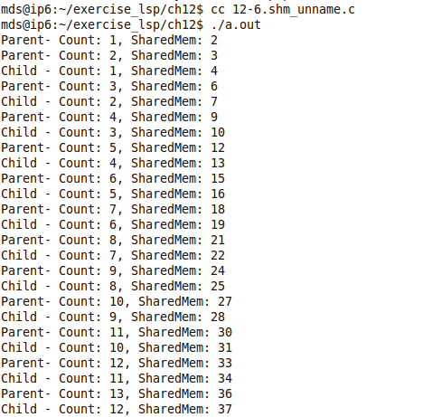

# 2. IPC

## 2.1 IPC 소개

- IPC
    - 프로세스간 통신 정의, 테스크간 통신 정의도 ITC라 하기도한다.
    - 방법
		- 기본적은 통신 기법(UNIX) : PIPE와 FIFO
		- 공유데이터 방식 (Shared memory) : 세마포어 등에 의해 동기화 필요
		- 메세지 우편함
		- 메세지 큐

- IPC 필요한 이유
    - 프로세스들 간에 메모리는 독립되어 있으므로 서로의 자료를 전달할 필요가 있다.
    - 공유된 커널 메모리를 이용하여 프로세스간 통신해결
    - 전통적인 생산자와 소비자 프로세스처럼 프로그램에서 데이터 전달 빈번

## 2.2 PIPE
- 개요
    - UNIX 시스템에서 가장 오래된 IPC 매커니즘으로 단방향 통신 채널
- 특징
	- 표준 입력을 읽고 표준 출력에 쓰는 프로그램은 다른 프로세스와 통신할 수 있다는 것을 알 필요도 없고 상관할 필요도 없다.
	- 채널의 한쪽 끝에서 쓰여진 데이터는 다른 쪽 끝으로 나오게 된다.
- 구분
    - Un-named pipe
    - Named pipe (= FIFO)

## 2.3 un-named pipe
```c
#include <unistd.h>
int pipe(int filedes[2])
```
- 매개 변수 값은 두 개의 요소를 가진 정수 배열의 주소이다.
- pipe()는 성공하면 0을 반환하고 오류가 있으면 -1을 반환한다.
- 호출이 성공하면 두 개의 열린  file descripter를 추가적으로 가지게 된다.
- filedes[0] : 파이프의 읽기 끝 단(read end)
- filedes[1] : 파이프의 쓰기 끝 단(write end)
- 이름 없는 PIPE는 파일 기술자의 상속을 이용하여 서로 다른 공간상의 두 프로세스가 PIPE에 접근할 수 있도록 하는 방법이다.
	- PIPE의 한계는 <u>부모와 자식 or 같은 부모의 자식들간의 관계여야만 가능하다는 점이다.</u>

### un-named pipe 예제
```c
// 12-1.pipe_test.c
#include <stdio.h>
#include <stdlib.h>
#include <errno.h>
#include <unistd.h>
#include <string.h>
#define BUFSIZE 30

//--------------------------------------
// Create a pipe, write to it, and read from it.
int main( int argc, char **argv )
{
	static const char mesg[] = "www.mdsacademy.co.kr";
	char buf[BUFSIZE];
	ssize_t rcount, wcount;
	int pipefd[2]; /*pipe descriptor */
	size_t len;

	/* TODO: create pipe descriptors pair */
	
	if ( pipe(pipefd) < 0 ) 
	{
		fprintf(stderr, "%s: pipe failed : %s\n", argv[0], strerror(errno));
		exit(1);
	}
	printf( "Read end = fd %d, write end = fd %d\n",pipefd[0], pipefd[1]);

	len = strlen(mesg);
	/* put to write end */	
	wcount = write( pipefd[1], mesg, len);

	/* get fr. read end */
	// PIPE에 써진 string을 buf로 읽어들인다.
	rcount = read( pipefd[0], buf, BUFSIZE);

	buf[rcount] = '\0'; /* make null-term string */
	printf( "Read <%s> from pipe \n", buf );
	
	close( pipefd[0] );
	close( pipefd[1] );

	return 0;
}
```

```c
// 12-1.pipe_test_pork.c
#include <stdio.h>
#include <stdlib.h>
#include <errno.h>
#include <unistd.h>
#include <string.h>
#define BUFSIZE 30

//--------------------------------------
// Create a pipe, mom write to it, and son read from it.
int main( int argc, char **argv )
{
	static const char mesg[] = "www.mdsacademy.co.kr";
	char buf[BUFSIZE];
	ssize_t rcount, wcount;
	int pipefd[2]; /*pipe descriptor */
	size_t len;

	pid_t son;
	
	/* TODO: create pipe descriptors pair */

	if ( pipe(pipefd) < 0 ) 
	{
		fprintf(stderr, "%s: pipe failed : %s\n", argv[0], strerror(errno));
		exit(1);
	}

	son = fork();

	printf( "Read end = fd %d, write end = fd %d\n",pipefd[0], pipefd[1]);
	len = strlen(mesg);

	if (son != 0)	// mom
	{
		/* put to write end */	
		wcount = write( pipefd[1], mesg, len);
		printf( "mom: Writ <%s> To. pipe \n", mesg );
		wait(NULL);
	}
	
	if (son == 0)	// son
	{
		sleep(1);
		/* get fr. read end */
		// 부모 프로세스에서 PIPE에 값을 쓴 것을
		// 자식 프로세스에서도 접근하여 읽어올 수 있다.
		rcount = read( pipefd[0], buf, BUFSIZE);

		buf[rcount] = '\0'; /* make null-term string */
		printf( "son: Read <%s> Fr. pipe \n", buf );
	}
	
	close( pipefd[0] );
	close( pipefd[1] );

	return 0;
}
```


## 2.4 FIFO(Named PIPE)

### 1. 개요
- 부모와 자식 or 같은 부모의 자식들간의 관계여야 같이 접근할 수 있는 PIPE(Un-named PIPE)의 한계를 넘어 <u>부모 자식간의 관계가 아니더라도 접근이 가능하다.</u>
- mkfifo()를 사용하여 FIFO 생성

### 2. FIFO 실습
```c
// fifo_receiver.c
#include <stdio.h>
#include <stdlib.h>
#include <string.h>
#include <fcntl.h>
#include <unistd.h>
#define FIFO_FILE "/tmp/fifo"
#define BUFF_SIZE 1024

int main( void)
{

	int fd;
	char buff[BUFF_SIZE];

	// /tmp/fifo 경로에 접근
	if ( access(FIFO_FILE,0) != 0 )
	{
		if ( -1 == mkfifo( FIFO_FILE, 0666))
		{
			perror( "mkfifo() error");exit( 1);
		}

		system("ls -l /tmp/fifo");

	}
	// fifo 파일을 연다.
	if ( -1 == ( fd = open( FIFO_FILE, O_RDONLY)))
	{
		perror( "open() error");
		exit( 1);
	}

	sleep(1);
	// buff를 초기화 해주고 fifo에 적여있는 문자를 읽어온다.
	memset( buff, 0, BUFF_SIZE);
	read( fd, buff, BUFF_SIZE);

	printf("received string is :  %s\n", buff);

	close( fd);
}
```
```c
// fifo_sender.c
#include <stdio.h>
#include <stdlib.h>
#include <string.h>
#include <fcntl.h>
#include <unistd.h>

#define FIFO_FILE "/tmp/fifo"

int main(void)
{
	int fd;
	char *str = "mdsacademy.co.kr";

	// /tmp/fifo 파일 접근 권한 확인
	if ( access(FIFO_FILE,0) != 0 )
	{
		// /tmp/fifo에 접근 불가(파일 없음)하면 FIFO를 생성
		if ( -1 == mkfifo( FIFO_FILE, 0666))
		{
			perror( "mkfifo() error");exit( 1);
		}

		system("ls -l /tmp/fifo");

	}
	// fifo 파일을 열고 str을 써준다.
	if ( -1 == ( fd = open( FIFO_FILE, O_WRONLY)))
	{
		perror( "open() error");
		exit( 1);
	}
	write( fd, str, strlen(str));
	close( fd);
}
```
```shell
./r & 
./s
```
  

## 2.5 Message Queue

### 1. 메시지 큐

- 버퍼형태 오브젝트
- 어러 테스크와 ISR를 통해 메시지를 주고 받으며 데이터 통신과 동기화 수행
- 메시지 큐는 원하는 수신자가 메시지를 읽어갈 때까지 메시지를 임시로 보관하는 역할한다.
- 버퍼링 메커니즘을 통해서 `수신 테스크`와 `송신 테스크`를 나누어 관리할 수 있다.

### 2. 메시지 큐 종류
- POSIX 계열 메시지 큐
	- 각 메시지는 우선순위를 가지며 우선순위가 같은 경우 FIFO 사용
- SysV 계열 메시지 큐 (IBM)
	- 리눅스는 보통 UNIX로 계속 계승 되어오는 SysV계열 메시지 큐를 사용
	- 속도가 POSIX에 비해 빠르다.

### 3. 메시지 큐 구성
- 메시지 큐 생성시 할당 요소
	- 큐 제어 블록 (QCB : Queue Control Block)
	- 메시지 큐 이름
	- 고유 ID
	- 메모리 버퍼
	- 큐 전체 길이
	- 최대 메시지 길이
	- 하나 이상의 테스크 대기 리스트
- 커널 담당 : QCB, 테스크 리스트 생성 및 고유 ID를 메시지 큐에 할당
- 메시지 큐 메모리 계산 : 프로그래머로 부터 큐 길이, 최대 메시지 길이 같은 파라미터를 받아들여 계산
- 송신 태스크 대기 리스트
	- 큐가 비어있을 때 메시지를 받기 위해 대기 중인 테스크들을 기록
- 송신 테스크 대기 리스트
	- 큐가 가득 차 있을 때 메시지를 보내기 위해 대기 중인 테스크들을 기록

### 4. 메시지 큐의 상태도

- FSM(Finite State Machine) 로직에 의해 동작
- FSM의 초기 상태는 `빈 상태`
- 비어있는 상태 메시지 수신
	1. 메시지 수신을 시도한 테스크 block되어 원할 경우 테스크 대기 리스트에 놓임
	2.  이 상태에서 다른 테스크가 메시지 큐로 메시지를 보내면 메시지는 블록 된 테스크로 직접 전달 됨
	3. 이 후 태스크 대기 리스트에서 삭제 되고 준비 상태 또는 실행 상태로 변환
	4. 큐는 여전히 빈 상태가 됨


### 4. 메시지 큐의 내용
- 다양한 데이터
	- 온도 센서 값, 디스플레이 장치 비트맵 데이터, LCD 출력 문자 메시지, 키보드 이벤트, 네트워크로 전송할 데이터 패킷
- 메시지 길이가 매우 큰 경우
	- 데이터 자체가 아닌 데이터 포인터를 메시지로 보낸다.
- Task to Task 메시지 복사
	- 복사 2회 발생
	- 송신 테스크 메모리 영역 -> 메시지 큐의 메모리 영역 -> 수신 테스크 메모리 영역

### 5. 예제 실습

```c
// 12-4.posix_mq_a.c
#include <stdio.h>
#include <mqueue.h>
#include <pthread.h>
#include <time.h>

/* TODO: define message queue variable */

mqd_t mq;

void send_thread( void ) {
	char c = 'A';
	unsigned int prio = 0;

	while (1) {
		printf( "S(%c, prio = %d)\n", c, prio );
/* TODO: send c via message-q */ 
		mq_send(mq, &c, sizeof(c), prio);

		if ( ++c > 'z' ) c = 'A';
		if ( ++prio > 10 ) prio = 0;

		sleep(1);
	}
}

void recv_thread( void ) {
	char msg[64];
	int len;
	unsigned int prio=0;

	while (1) {
/* TODO: receive message from message-q */ 
		len = mq_receive(mq, msg, sizeof(msg), &prio);
		sleep(1);

		if ( len > 0 ) {
			msg[len] = '\0';
			printf( "\t\tR(%s, prio = %d)\n", msg, prio );
		}
	}
}

void main( void ) {
	pthread_t threads[2];
	pthread_attr_t      attr0, attr1;

/*TODO: */ 
	struct mq_attr attr;

/*TODO: */ 
	attr.mq_maxmsg  =  3;
	attr.mq_msgsize = 10;
	attr.mq_flags   =  0;

/*TODO: open message_q file /w O_RDWR | O_CREAT flags */
	//a 메시지 큐 생성
	mq = mq_open("/mqueue", O_RDWR|O_CREAT,0,&attr);
	if(mq == -1)
	{
		perror("mq_open error");
		exit(0);
	}	

	// send, receive 스레드 생성
	pthread_attr_init(&attr0); pthread_attr_init(&attr1);
	pthread_create(&threads[0], &attr0, (void*)recv_thread, NULL);
	pthread_create(&threads[1], &attr1, (void*)send_thread, NULL);

	pthread_exit(0);
}
```


- `int mq_close(mqd_t)` : 메시지 큐 닫힘
	- mqd_t mqdes : 메시지 큐 기술자
- `int mq_unlink(&name)`
	- 메시지 큐 제거 단, 참조가 닫힐 때 까지 지연된다.
	- const char *name : 제거할 메시지 큐의 이름

## 2.7 Shared memory

### 1. 공유 메모리를 이용한 통신

- 임의의 프로세스가 공유 메모리에 데이터를 쓰면 다른 프로세스가 이 내용을 읽어 결국 프로세스 간에 통신이 이루어진다.

### 2. 공유 메모리 특징(System V)
- 메모리 복사 오버헤드가 없기 때문에 다른 IPC보다 빠른 속도를 보여준다.
- **shared memory 주의할 점**
	- <u>메모리에 접근 할 땐 데이터 훼손이 있을 수 있으므로 동기화 기법이 필요하다.</u>
- 공유 메모리를 만들면 직접 삭제하지 않는 한 공유메모리 공간이 유지된다.
	- shmid_ds 라는 구조체에서 관리
- 공유 메모리 요청을 위해 shmget 시스템 콜을 사용
	- 접근 권한, 생성 방식 등을 결정할 수 있다.

### 2. 실습 : Named shared memory - server, client 구조
```c
// server.c
#include <sys/types.h>
#include <sys/ipc.h>
#include <sys/shm.h>
#include <stdio.h>
#include <semaphore.h>
#include <sys/types.h>
#include <sys/stat.h>
#include <fcntl.h>
#include <stdlib.h>

#define SHMSZ 27
char SEM_NAME[]= "vik";

int main()
{
	char ch;
	int shmid;
	key_t key;
	char *shm,*s;
	sem_t *mutex;	//name the shared memory segment
	key = 1000;

	// 세마포어 생성
	mutex = sem_open(SEM_NAME,O_CREAT,0644,1);
	if(mutex == SEM_FAILED){
		perror("unable to create semaphore");
		sem_unlink(SEM_NAME); 
		exit(-1);
	}
	
	// shmid : shared memory 식별자(key)
	// 공유 메모리 할당
	shmid = shmget(key,SHMSZ,IPC_CREAT|0666);
	if(shmid<0){
		perror("failure in shmget"); 
		exit(-1);
	}
	
	// shmid 식별자로 할당된 shared memory에 가상 주소와 연결
	// shm : 연결된 가상 주소
	shm = shmat(shmid,NULL,0);

	// 할당 받은 가상 주소지에 'A' ~ 'Z' 입력
	s = shm;
	for(ch='A';ch<='Z';ch++){
		// 메모리 데이터 훼손 방지를 위해 동기화 기법 사용
		sem_wait(mutex);
		*s++ = ch;
		sem_post(mutex);
	}
	
	// client가 데이터 읽기를 완료하면 '*' 문자를 써놓는다.
	// 아래 루프는 이진 세마포어로 대체 가능
	while(*shm != '*'){
		sleep(1);
	}
	// 세마포어 닫기
	sem_close(mutex);
	// 세마포어 해제
	sem_unlink(SEM_NAME);
	// 공유 메모리 삭제
	shmctl(shmid, IPC_RMID, 0); 
	exit(0);
}
```
```c
// client.c
#include <sys/types.h>
#include <sys/ipc.h>
#include <sys/shm.h>
#include <stdio.h>
#include <semaphore.h>
#include <sys/types.h>
#include <sys/stat.h>
#include <fcntl.h>
#include <stdlib.h>
#define SHMSZ 27

char SEM_NAME[]= "vik";
int main()
{
	char ch;
	int shmid;
	key_t key;
	char *shm,*s;
	sem_t *mutex;	//name the shared memory segment
	
	key = 1000;

	// 세마포어 생성
	mutex = sem_open(SEM_NAME,0,0644,0);
	if(mutex == SEM_FAILED){
		perror("reader:unable to execute semaphore");
		sem_close(mutex);
		exit(-1);
	}
	
	// server와 같은 key를 이용해 동일 공유 메모리에 접근(생성)
	shmid = shmget(key,SHMSZ,0666);
	if(shmid<0){
		perror("reader:failure in shmget");
		exit(-1);
	}
	
	// 가상 메모리 주소 획득
	shm = shmat(shmid,NULL,0);
	// 공유 메모리 주소에 쓰여진 문자를 putchar로 읽어 옴
	s = shm;
	for(s=shm;*s!=0;s++){
		sem_wait(mutex);
		putchar(*s);
		sem_post(mutex);
	}
	
	// 모두 읽어 내면 공유 메모리 주소에 '*' 입력
	*shm = '*';
	// 세마포어 닫기
	sem_close(mutex);
	// 공유 메모리 삭제
	shmctl(shmid, IPC_RMID, 0);
	exit(0);
}
```
```shell
./s & 
./c &
sleep 2
kill %1
kill %2
```


### 3. 실습 : Un-named shared memory - mom, son(by fork) 구조
```c
// 12-6.shm_unname.c
#include <sys/ipc.h>  
#include <sys/shm.h>  
#include <string.h>  
#include <unistd.h>  
#include <stdio.h>
#include <stdlib.h> 
 
int main() {

	int shmid;
	int pid;
	int cnt;

	int *cal_num; 
	void *shared_memory = (void *)0;
	
	// 공유 메모리 생성
    shmid = shmget((key_t)1234, sizeof(int), 0666|IPC_CREAT); 
    if (shmid == -1) 
    { 
        perror("shmget failed : "); 
        exit(0); 
    } 
	
	// 가상 메모리 연결
    shared_memory = shmat(shmid, (void *)0, 0); 
    if (shared_memory == (void *)-1) 
    { 
        perror("shmat failed : "); 
        exit(0); 
    } 


    cal_num = (int *)shared_memory; 

	// 자식 프로세스 생성
    pid = fork(); 

    if (pid == 0) /* child */
    { 
	shmid = shmget((key_t)1234, sizeof(int), 0); 
        if (shmid == -1) 
        { 
            perror("shmget failed : "); 
            exit(0); 
        } 
        shared_memory = shmat(shmid, (void *)0, 0666|IPC_CREAT); 
        if (shared_memory == (void *)-1) 
        { 
            perror("shmat failed : "); 
            exit(0); 
        } 
        cal_num = (int *)shared_memory; 
        *cal_num = 1; 
	cnt = 0;
 
        while(1) 
        { 
		sleep(1); 
		cnt+=1;
            	*cal_num = *cal_num + 1; 
            	printf("Child - Count: %d, SharedMem: %d\n", cnt, *cal_num);  
        } 
    } 
 
    else if(pid > 0) /* mother */
    { 
	cnt=0;
        while(1) 
        { 
		cnt+=1;
		*cal_num = *cal_num + 2;
		printf("Parent- Count: %d, SharedMem: %d\n", cnt, *cal_num);  
		sleep(1);
        } 
    } 
} 
```


## 2.8 Signal 및 고급 IPC

### 1. 시그널이란
- 커널을 통해 프로세스에게 전달하는 비동기적 이벤트
	- 예외처리
		- 프로세스가 예외 동작을 했을 때 시스템이 프로세스의 행동을 제한함
	- 외부에서 프로세스의 행동 지시
		- 다른 프로세스에서 동작 지시하거나 터미널 키로 제한 가함
	- 자원 할당 예외
	- 특정 이벤트 발생을 감지
		- I/O 인터페이스에 따라서 이벤트 발생을 통보함

### 2. 시그널의 전달 과정

- 키보드 입력을 보고 SIGQUIT 시그널을 현재 foreground 프로세스에게 전달.
- 시그널을 전달받은 프로세스가 현재 작동 중이라면 인터럽트 당한 뒤에 유저 모드로 복귀하면서 시그널 핸들러가 실행
- 기본 행동이 지정되어 있지 않으면 프로세스는 종료 요청과 코어 덤프
	- 코어 덤프란 : 컴퓨터 프로그램이 특정 시점에 작업 중이던 메모리 상태를 기록한 것으로, 보통 프로그램이 비정상적으로 종료했을 떄 만들어진다.

```c
// sig_action.c
#include <signal.h> 
#include <unistd.h> 
#include <string.h> 
#include <stdio.h> 
#include <stdlib.h>

void sig_int(int signo);
void sig_usr(int signo);

int main()
{
    int i = 0;
    struct sigaction intsig, usrsig;

	// signal 처리기 함수 포인터
    usrsig.sa_handler = sig_usr;
	// 블록킹 마스크된 시그널 집합을 초기화
    sigemptyset(&usrsig.sa_mask);
    usrsig.sa_flags = 0;

    intsig.sa_handler = sig_int;
    sigemptyset(&intsig.sa_mask);
    intsig.sa_flags = 0;

    if (sigaction(SIGINT, &intsig, 0) == -1)
    {
        printf ("signal(SIGALRM) error");
        return -1;
    }    

    if (sigaction(SIGUSR2, &usrsig, 0) == -1)
    {
        printf ("signal(SIGUSR2) error");
        return -1;
    }    

    while(1)
    {
        printf("%d\n", i);
        i++;
        sleep(1);
    }
}

void sig_int(int signo)
{
    sigset_t sigset, oldset;
	// sigset이 모든 신호를 포함하는 것으로 초기화
    sigfillset(&sigset);
    // 새로 들어오는 모든 시그널에 대해서 block 한다. 
    if (sigprocmask(SIG_BLOCK, &sigset, &oldset) < 0)
    {
        printf("sigprocmask %d error \n", signo);
    }
    fprintf(stderr, "SIGINT !!!!\n");
    sleep(5);
}

void sig_usr(int signo)
{
    printf("sig_usr2\n");
}
```