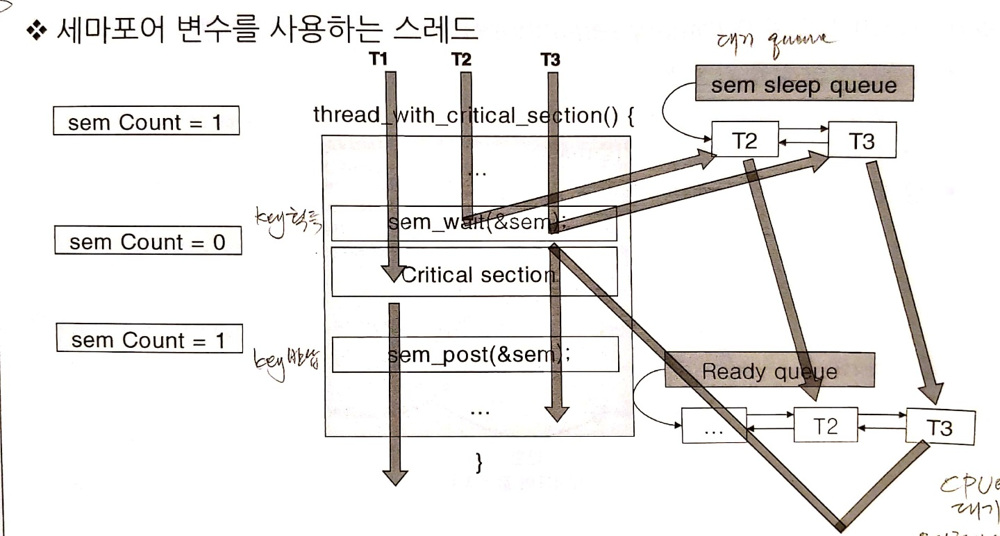
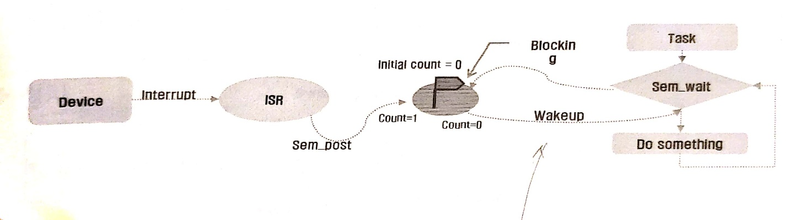
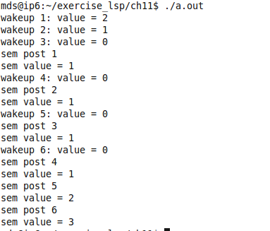
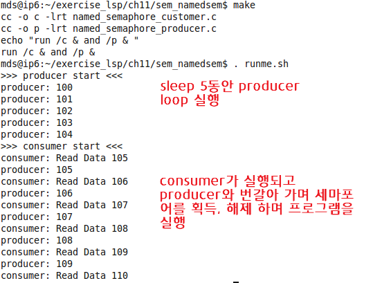
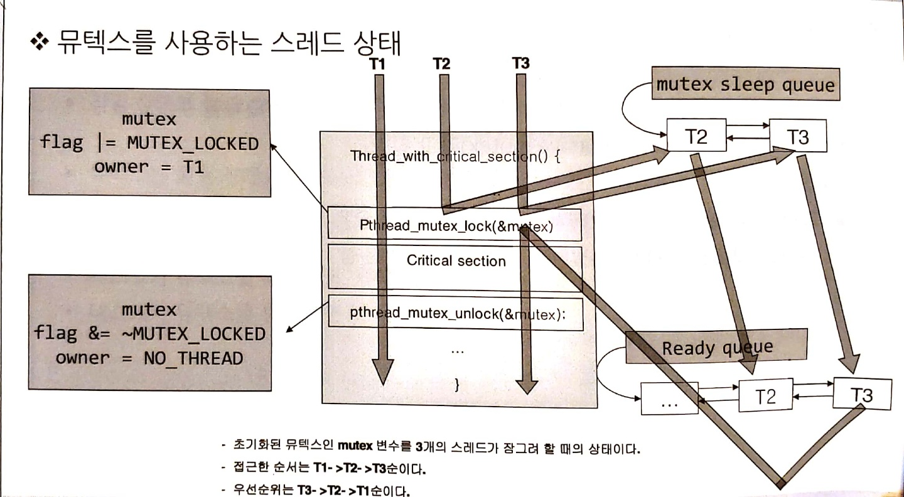
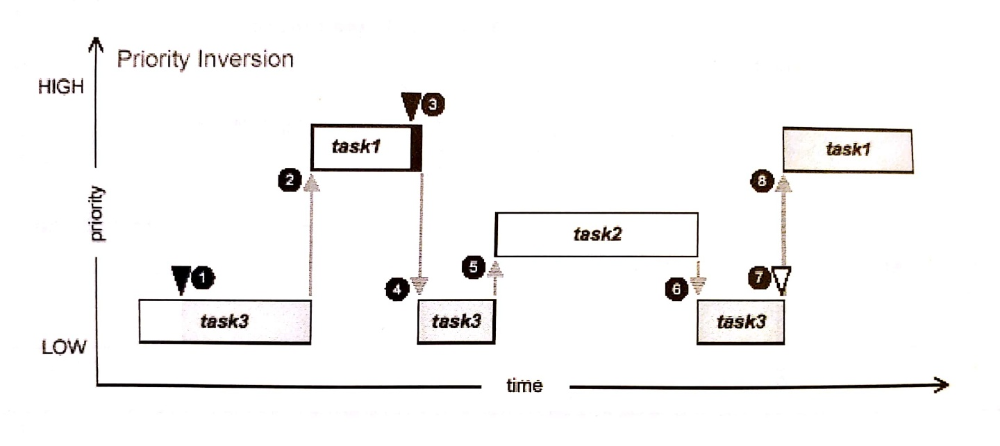
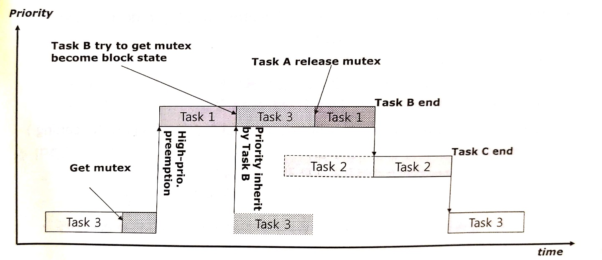
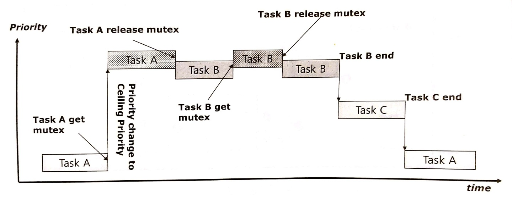

# 1. 동기화

## 1.1 동기화 개요

### 1. 동기화 필요 이유
- 여러놈이 하나에 대해 달려드는 것
- 두 개 이상의 프로세스가 동일한 자원에 접근할 때 잘못된 연산을 없애고 일관성을 보장해야 한다.
- '열쇠'를 놓고 열쇠를 지는 사람만이 자원에 접근할 수 있게 하는 것

### 2. 동기화 방식
- 세마포어
- 뮤텍스 : 세마포어 확장 형태
- 조건 변수(conditional variable)

## 1.2 세마포어(Semaphore)

### 1. 개요
- 정의 : 여러 태스크가 동기화를 목적으로 획득하거나 반환할 수 있는 `커널 오브젝트`
- 필요성 : 공유 자원에 접근하고자 하는 테스크가 배타적으로 자원에 접근하고자 할 때
- 유형
    - binary semaphore : 두개의 key로만 한정
    - counting semaphore : 가져간 key의 개수를 카운팅
### 2. 연산
- initialize(create)
- wait(pend) : key를 얻기 위해 대기하는 것
- signal(post) : key를 전달하기 위해 queue에서 sleep하는 것들 깨우는 역할

### 3. 세마포어 생성시 커널이 하는 일
- 시마포어 제어블록(SCB, Semaphore Control Block) 생성
- ID값 할당
- 초기값(바이너리 혹은 카운트) 할당
- 태스크 대기 리스트 할당

### 4. 동작
- 태스크가 세마포어(key)를 획득할 경우에만 자원에 접근 가능
- 테스크는 하나의 세마포어를 여러번 획득할 수 있다(count 세마포어)
    - 횟수에 제한되며 이 횟수는 세마포어를 생성할 떄 결정
    - 토큰 카운트로 획득 횟수 파악
- 세마포어 카운트가 한계 값이 도달하면 반환할 때 까지 더 이상 세마포어 획득할 수 없다.
    - 대기 리스트에서 블록 상태로 대기 혹은 포기한다.

### 5. 세마 포어 유형
- 바이너리 세마포어
    - 0 또는 1의 값을 가진다
        - 0 : 세마포어 사용 불가 (empty)
        - 1 : 세마포어 사용 가능
    - 생성할때 empty, full 상태 지정 가능

- 카운팅 세마포어 
    - 내부 카운터 사용
    - 여러 차례 획득하고 반환 가능
    - 테스크는 내부 토큰 값이 소진 될 떄까지 계속 획들할 수 있다.
    - 세마포어 생성할 때 초기 토큰 개수 지정

### 6. 세마포어 변수를 사용하는 스레드 실행 과정

- *참고 : 위의 세마포어의 내부 카운터는 1로 설정 되어있다.
1. 초기화 된 세마포어 변수 sem을 T1, T2, T3 각 3개의 스레드가 획득 하려는 상황
2. T1이 sem을 획득하면서 내부 count를 하나 감소시킨다. count가 0이 되면서 이후 세마포어를 잠그려고 시도하는 스레드는 block이 된다.
3. T1의 `상호 배제 구역`의 동작을 수행 중에 sem을 획득하려한 T2와 T3는 sem의 sleep queue에 들어가 block된다.
4. T1이 `상호 배제 구역` 내의 동작 수행을 완료하고 `sem_post()`를 통해 sem 하나가 반환 된다.
5. sleep queue에 block되어 있던 T2, T3를 ready queue로 넣어준 후 return 한다.
6. 이 때 sem 획득 시도한 순서 (sleep queue에 삽입된 순서)와 상관 없이 스레드 <u>우선순위가 높은 순</u>으로 다음 sem을 획득할 수 있다.


## 1.3 POSIX 세마포어

### 1. 종류
- 이름없는 세마포어
    - 이름이 없어도 알기 때문에 이름 지정 해주지 않음
    - 전역변수 형태로 정의
    - *동일 주소 공간* 내의 **스레드 간**에 사용
- 이름있는 세마포어
    - 이름으로 부르기 위해
    - 특정 이름(/name 형태) 문자열 형태로
    - *다른 주소 공간* 간의 **프로세스 간**에 사용


### 2. 관련 API
- wait
    - 획득 시도, 실패할 경우 기다린다. sleep
    - 카운터 값을 1만큼 감소, 0인 경우 이 함수를 호출한 스레드(calling thread)를 블록 시킨다.
- post
    - 세마포어를 반환 (1만큼 증가)
    - 대기큐에 있는 프로세스들을 모두 깨워 Ready 큐로 이동 시킨다.
- trywait
    - 한번 찔러보고 포기하는 것
    - 세마포어의 값이 0일 때 바로 에러 값으로 리턴
- getvalue
    - 세마포어 현재 카운트 값

- destroy
    - 이름없는 세마포어 제거(자원 반납)
- close
    - 이름있는 세마포어 닫기만 한다.
- unlink
    - 다른 프로세스들이 참조하고 있으면 block 하고 있다가 아무도 참조하지 않은 시점에 세마포어 제거된다.

### 3. 세마포어 응용
- 응용 예1

- Wait / Signal
1. 외부 Device가 인터럽트 요청
2. 인터럽트 핸들러가 sem_post를 발생 시켜 count를 1로 만들어 줌 (초기 키운트 0)
3. sleep queue에 있던 task를 깨우고 task가 sem_wait로 세마포어를 획득한다.
4. 상호 배제 구역 (세마포어를 획득하고 반환하는 동작 사이에 있는 구역)에 저정된 동작을 수행하고 다시 세마포어를 반환한다.

### 4. 주의점
- deadlock
    - 양쪽 서로 원하는 걸 가지고 있을 때 교착상태가 된다.
    - 서로 sem1, sem2를 원하고 있어서 block되어 실행이 막혀있다. 요즘은 회피하도록 설계 되어있다.

### 5. 실습

- sem_test
```c
#include <stdio.h>
#include <semaphore.h>
#include <pthread.h>

sem_t        sem;  /*TODO: semaphore variable - sem */
pthread_t   task;

void Thread( void ) {
    int i = 0;
    int val;
  
    while(1) {
        i++;

        // 부모보다 먼저 세마포어를 획득한다.
        sem_wait( &sem ); /* TODO: take semaphore */

        // 루프 조건을 만족할때 까지 동작을 수행하고 종료 된다.
        sem_getvalue( &sem, &val ); /* get sem value to val */
        printf( "wakeup %d: value = %d\n", i ,val );
        
        if ( i > 5 ) break;
    }
}
//----------------------------------------
void main( void )
{
    int i = 0, j, val;

    // 이름 없는 세마포어 초기화
    // (세마포어 구조체 변수, 0: 세마포어 스레드 사이 공유, 세마포어 초기값(init count = 3)
    sem_init( &sem, 0, 3 ); /* TODO: init unnamed semaphore */

    // 자식 스레드 생성
    pthread_create( &task, NULL, (void*(*)(void*))Thread, NULL );
    
    while(1) {
        sleep(1); // 부모 스레드가 sleep 하는 타이밍에 자식스레드 실행
        i++;

        printf( "sem post %d\n", i );
        sem_post( &sem ); /* TODO: give semaphore */

        sem_getvalue( &sem, &val ); /* get sem value to val */
        printf( "sem value = %d\n", val );

        if ( i > 5 ) break;
        
    }
}
```
  
1. 자식 스레드가 생성되고 세마포어 초기 카운트 3이 다 소진될 때까지 loop문을 돌며 printf를 출력한다.
2. 자식 스레드가 block 상태가 되고 리더 스레드에 CPU권한이 넘어온다.
3. `sem_post`가 샐힝되며 세마포어 한개를 반환해주고 나머지 프로그램을 실행한다.
4. 다시 while loop를 돌아 sleep을 실행하는 찰나에 자식 스레드로 CPU권한이 넘어간다.
5. 리더 스레드에서 세마포어가 반환되어 block이 해제되고 다시 자식 스레드가 세마포어를 획득하여 프로그램 수행한다.
6. 자식 스레드의 loop 탈출조건이 만족될 때까지 이러한 동작을 반복하다가 자식 스레드가 종료가되고 리더 스레드가 나머지 동작을 완료하고 종료된다.


- sem_namedsem
    - producer가 파일에 값을 쓰고, customer가 파일의 값을 읽는 동작을 동기화되어 수행한다.
```c
// sem_namedsem_producer
#include <semaphore.h>
#include <sys/types.h>
#include <fcntl.h>
#include <sys/stat.h>

#include <stdlib.h>
#include <stdio.h>

const char *countFile = "count.db";
int main(int argc, char **argv)
{
    int count = 100;
    int fd;
    sem_t *mysem;
    sem_unlink("mysem"); // 기존의 것 끊기
    // 이름있는 세마포어 초기화
    // (세마포어 객체, oflag, 권한 설정, 세마포어 개수)
    if((mysem = sem_open("mysem", O_CREAT, 0777, 1)) == NULL)
    {
        perror("Sem Open Error");
        return 1;
    }
    // 파일 생성
    if( (fd = open(countFile,O_CREAT|O_RDWR, S_IRUSR|S_IWUSR )) == -1)
    {
        perror("Open Error\n");
        return 1;
    }
    while(1)
    {
    sem_wait(mysem); // 세마포어 획득
//        lseek(fd, 0, SEEK_SET);
//        read(fd, (void *)&count, sizeof(count));
//        printf("Read Data %d\n",count);

        printf("producer: %d\n",count++);
        lseek(fd, 0, SEEK_SET); // file pointer 처음으로 이동
        write(fd, (void *)&count, sizeof(count));

    sem_post(mysem); // 반납
        sleep(1); // stop consumer from getting semaphore
    }
    close(fd);
}
```


```c
// sem_namedsem_consumer
#include <semaphore.h>
#include <sys/types.h>
#include <fcntl.h>
#include <sys/stat.h>

#include <stdlib.h> 
#include <stdio.h>
        
const char *countFile = "count.db";
int main(int argc, char **argv)
{       
        int count;
        int fd; 
        sem_t *mysem;
        // 같은 이름의 세마포어 사용
        if((mysem = sem_open("mysem", 0, 0777, 0)) == SEM_FAILED)
        {
                perror("Sem Open Error");
                return 1;
        }
        if( (fd = open(countFile,O_RDWR)) == -1)
        {
                perror("Open Error\n");
                return 1;
        }
        while(1)
        {       
                sem_wait(mysem);

                lseek(fd, 0, SEEK_SET);
                read(fd, (void *)&count, sizeof(count)); // prducer가 파일에 쓴 값을 읽음
                printf("consumer: Read Data %d\n",count);
                
//                count++; 
//                lseek(fd, 0, SEEK_SET);
//                write(fd, (void *)&count, sizeof(count));
                sem_post(mysem);
                sleep(1); 
        }       
        close(fd);
}    
```
```shell
echo '>>> producer start <<<'
./p &
sleep 5
echo '>>> consumer start <<<'
./c &
sleep 5
kill %2
kill %1
```
   

## 1.4 MUTEX

### 1. 개요
- 정의 ; 스레드 간의 상호 배제 구현을 위한 동기화 커널 객체
- 상호 배제 구간
    - 스레드 safe한 구간 여러 스레드가 동시에동작해도 안전한 구간
    - 스레드 하나만 들어와서 실행해야하는 구간
    - 다른 태스크의 간섭업시 배타적으로 사용해야 하는 구간
- 절차
    - 잠금하여 상호 배제 구간에 진입
    - 잠금 해제하여 상호 배제 구간 탈출

### 2. 상호 배제 세마포어
- 바이너리 세마포어 처럼 동작
- <u>소유권 개념, 재귀적 접근, 태스크 삭제 보호, 우선 순위 역전 회피 프로토콜(생성시 옵션 설정)</u> 등을 지원
- 뮤텍스는 소유하고있는 스레드 외에는 lock을 해제할 수 없다.
    - 세마포어는 다른 스레드가 key를 반납할 수 있다.

### 3. 소유권, 재귀적 잠금, 태스크 삭제 보호, 우선순위 역전 회피
 - 소유권 개념
    - 스레드가 lock을 실행했다면 lock 해제도 해당 스레드 외에는 할 수 없다.
- 재귀적 접근
    - 세마포어 처럼 획득 개념이면 count 제한이 있지만 잠금 상태에서 잠금하는 건 문제는 없는 동작이다. 잠금 횟수를 여러번 할 수 있다. 따라서 재귀적인 동작이 가능한 것
    - 하지만 10번 잠그면 10번 잠금 해제해야한다.
- 테스크 삭제 보호
    - 화장실 안에 key를 들고 들어갔는데 그 안에서 죽어버리면 그 화장실에 아무도 접근하지 못하게 된다, 그러나 뮤텍스는 그럴 염려가 없음
    - <u>뮤텍스 lock 해제를 하지못하고 스레드가 죽어버려도 뮤텍스를 계속 사용할 수 있다.</u>
- 우선순위 역전 회피
    - 세마포어 등의 동기화 기능 때문에 우선순위가 뒤바뀔 수 있는 염려가 있음. 뮤텍스는 그걸 방지할 수 있는 기능이 존재

### 4. 뮤텍스 사용 스레드 상태


### 5. 뮤텍스 API
- 초기화
    - 뮤택스 변수와 그 초기화 상수
    - mutex_init 함수 사용하는 방법도 있음

### 6. 실습
- test
```c
#include <semaphore.h>
#include <pthread.h>
#include <sys/types.h>
#include <stdio.h>

/* TODO: define mutex variable and initialize */ 
pthread_mutex_t mutex = PTHREAD_MUTEX_INITIALIZER;

int val;
int arg1 = 0, arg2 = 1;

void *Thread( void* arg ) 
{
    int i, j;
    
    for( i = 0; ; i++ ) {
        /* TODO: lock   the mutex */
        pthread_mutex_lock( &mutex );

        val = *(int*)arg;
        printf( "thread %d: %dth iteration: val = %d\n", *(int*)arg, i, val);

        /* TODO: unlock the mutex */
        pthread_mutex_unlock( &mutex );

        sleep(1);
    }
	pthread_exit(0);
}

int main( void ) {
    pthread_t  thread1, thread2;
    pthread_attr_t attr;
    
    pthread_attr_init( &attr );
    
    // 스레드 생성
    pthread_create( &thread1, &attr, (void*(*)(void*))Thread, &arg1 );
    pthread_create( &thread2, &attr, (void*(*)(void*))Thread, &arg2 );
    
    pthread_exit(0);

}
```

7. Condition variable
    - 조건의 변화를 알려주고 감지하는 동기화 기법
    - 뮤택스와 함께 사용하여 쓰레드간 동기화 구현

```c
#include <stdio.h>
#include <pthread.h>

pthread_t  thread;

pthread_mutex_t  mutex = PTHREAD_MUTEX_INITIALIZER;
pthread_cond_t   cond  = PTHREAD_COND_INITIALIZER;

int count = 0;

void* Thread ( void* arg ) {
    
    pthread_mutex_lock ( &mutex ); 
    
    while ( count < 5 ) {
        printf( "count = %d: wait...\n", count );

	/*TODO: wait for condition variable signal  */
    // 잠시 동안 리더 스레드에 뮤텍스 소유권을 넘겨주고 signal 넘어 올때 까지 대기
        pthread_cond_wait ( &cond, &mutex ); 
    }
    	printf( "count = %d: done...\n", count );
    
    pthread_mutex_unlock ( &mutex );

    pthread_exit(0);
}

void main ( void ) {
    int i;


    pthread_create( &thread, NULL, (void*(*)(void*))Thread, NULL );
    
    for ( i = 0; i < 10; i++ ) {
        sleep(1);
        pthread_mutex_lock  ( &mutex );

        count++;

        /* TODO: signal condition variable 'cond' */ 
		if (1)	// check condition
			pthread_cond_signal( &cond );

        printf( "condition signal %d\n", i );

        pthread_mutex_unlock( &mutex );
    }

    pthread_exit(0);
}
/****************************************
 Run:
*****************************************
count = 0: wait...
condition signal 0
count = 1: wait...
condition signal 1
count = 2: wait...
condition signal 2
count = 3: wait...
condition signal 3
count = 4: wait...
condition signal 4
count = 5: done...
condition signal 5
condition signal 6
condition signal 7
condition signal 8
condition signal 9
*****************************************/
```
1. 스레드 생성 후 sleep 하면서 자식 스레드가 먼저 실행 된다. 
2. 자식 스레드에서 lock을 한 후 상호 배제 구역이 시작되고 프로그램 실행 중 pthread_cond_wait이 실행 되면서 임시로 lock을 release해주고 condition signal이 다시 넘어 올 때까지 대기한다.
3. 리더 스레드에서 권한을 얻어 뮤텍스 lock을 한다. 이 후 count를 증가 시키고 condition signal을 보낸다.
4. 그러나 <u>condition signal을 보냈더라도 리더 스레드에서 lock을 하고 있으므로 자식 스레드가 다시 뮤텍스 lock 권한을 갖게 되는 것은 아니다.</u>
5. 리더 스레드의 뮤텍스가 unlock이 되고 다시 자식 스레드가 뮤텍스를 lock하여 프로그램이 실행된다. 이와 같은 동작을 반복한다.
6. 자식 스레드가 loop 조건을 먼저 만족한 후 리더 스레드가 마지막 loop를 돌다가 종료된다.

### 8. 우선순위 역전현상

- 고정 우선순위 선점형 스케줄링 정책(Real time)에서 발생
    - 낮은 우선순위 스레드가 높은 우선순위의 스레드의 순위를 계승

#### 1. 우선순위 역전현상 발생 과정  
  

1. task3이 실행되며 뮤텍스 lock 한다.
2. 동기화와 연관없는 task1이 실행되었다가 task3의 뮤텍스가 아직 lock 상태 이므로 CPU할당을 다시 task3로 넘기면서 동작을 마저 수행하고 unlock되도록 한다.
3. 하지만 task3이 실행되는 중에 task3 보다 우선순위가 높은 task2가 실행된다.
    - <u>여기서 문제는 task2가 task1보다 우선 순위가 낮다.</u>
    - 따라서 task1보다 우선순위가 낮은 task2가 먼저 실행되는 *우선순위 역전 현상*이 일어나게 된다.
4. task1은 task3가 task2이 후에 나머지 실행을 끝낸 후에서야 실행된다.

#### 2. 회피 방안
1. Priority Inheritance  

    1. task1이 task3에게 뮤텍스가 unlock될 때까지 CPU할당을 넘겨줄 때 <u>Task3의 우선순위를 Task1 우선순위로 계승 시켜준다.</u>
    2. 그로인해 task2의 우선순위가 임시적으로 task3보다 낮기 때문에 task1보다 먼저 실행되는 일이 없게 된다.
    3. task3가 mutex를 release 하는 순간에 task1이 실행 되고 task3의 우선순위는 다시 내려간다.
    4. 최종적으로 task1이 실행 종료 된 후 task2가 실행 되고 task3는 마지막 남은 작업을 마무리 하게 된다.

2. Priority ceiling  

    - 뮤텍스를 lock하는 task가 그 순간 일시적으로 최상위 우선순위를 갖게하는 방식  
    1. taskA가 뮤텍스를 lock하는 순간 최상위 우선순위로 올라간다.
    2. taskA가 뮤텍스를 unlock하는 순간 본래 최상위 우선순위를 갖고 있던 taskB가 샐행된다.
        - 이로인해 <u>taskA가 실행되는 동안 다른 task보다 상대적으로 낮은 우선순위를 가진 task가 실행될 일은 없어지게 된다.</u>
    3. 이 후 뮤텍스를 lock하는 여부와 상관없이 우선순위 기반으로 task 들이 실행된다.


